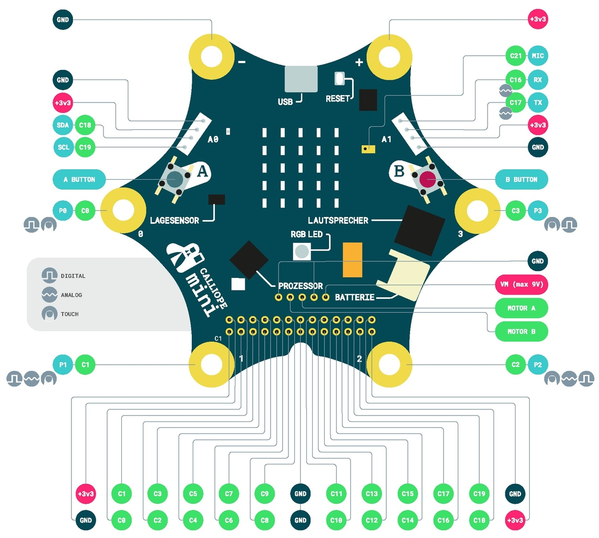
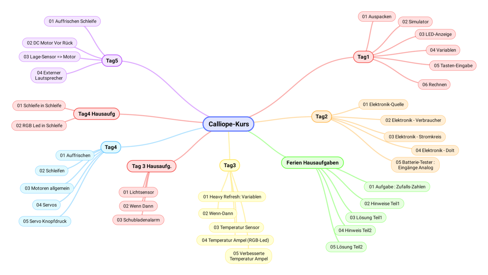
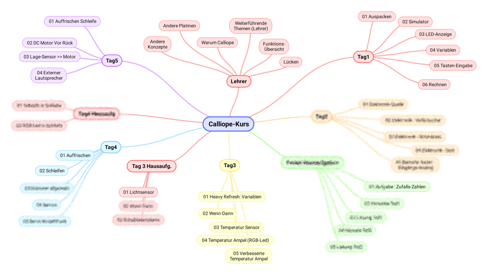
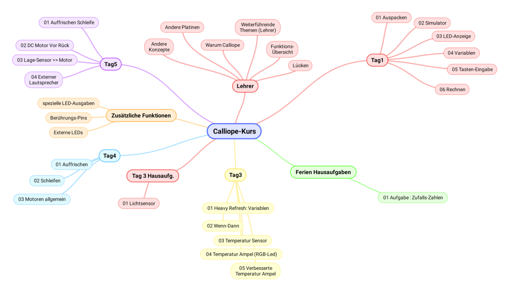
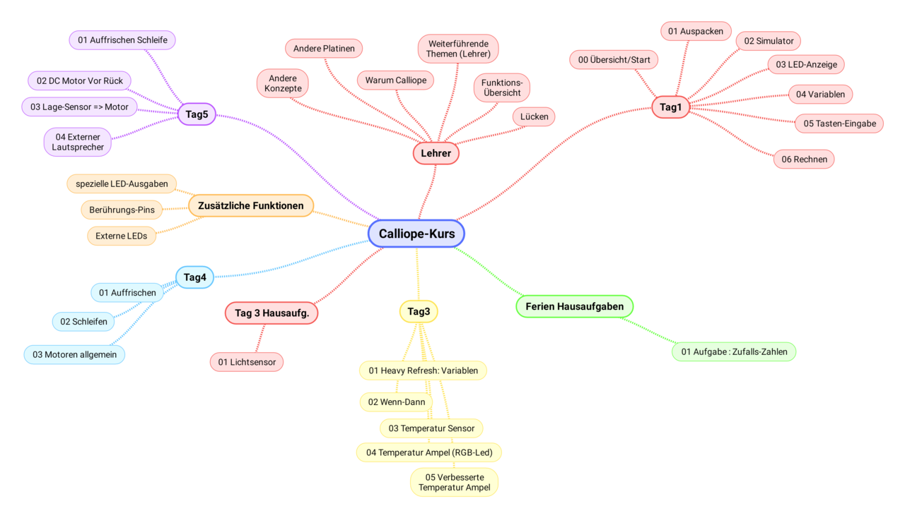

# Programmieren 

## Jogi Künstner

- Elektronik seit ~ 1975 
- Software / Embedded seit ~ 1980  
  Mein Junior-Computer: <http://www.wolfgangrobel.de/sbc/junior.htm>
- Elektrotechnik/Informations-Technik Studium Technische Uni München 
- Handy - Entwicklung Siemens München bis 2006, 
- inzwischen Software-Projekt-Leiter ( Roche-Linux ) bei Roche
- Vorstand Turbine
- Einige Elektronik Workshops Turbine
- Programmierkurs für Kinder Turbine (jetzt auch Lehrer)
- Mit-Organisation Repair-Cafes 

## Was ist Programmieren?

* Wer hat schonmal selbst programmiert ?
* Welche Programmiersprachen ?
* Wer hat schonmal ein EXCEL-Macro/Funktion erstellt

* Ist ein ferngesteuertes Auto fahren Programmieren ?

## Was passiert beim Programm ausführen? 

* Was macht der Mensch ?
* Was macht der Computer, der das Programm ausführt?

* Vergleich : 

   * Computer führt Programm aus
   * Mensch benutzt ein Rezept um zu backen

## Vergleich Programm <=> Backen mit Rezept

|                          | __REZEPT__                    | __PROGRAMM__                                    |
| ------------------------ | ----------------------------- | ----------------------------------------------- |
| Programmierer            | Rezept-Autor / Chef-Koch | Programmierer                                   |
| Ausführender             | Koch / Köchin                 | Computer                                        |
| Detailgrad der Anweisung | Wissen des Kochs              | "Höhe" der Programmiersprache                   |
| Reaktion auf Ereignisse  | Selbständig durch Koch        | Muss durch Programmierer vorher überlegt werden |
| Fehlerbehandlung         | Selbständig durch Koch        | Muss durch Programmierer vorgesehen werden      |

## Erste Schritte

## Kurze Demo Simples Programm

* Guter Start für Programmier-Anfänger
* Schon ab ca 6 Jahren möglich

Hour of Code: Starwars <https://studio.code.org/s/starwarsblocks/stage/1/puzzle/1>

## Abstraktions-Level 

- Ein Computer kann im Endeffekt nur 0 und 1 unterscheiden
- Das, was wir programmieren, muss noch weiter "ausdetailliert" werden
- Vergleiche eine Koch-Anweisung für einen Koch und für ein Kind
  (der Computer ist das "Kind", versteht nur ja und nein...)
- Das Aus-Detaillieren passiert bei uns im Hintergrund 
  (und wird "übersetzen", "compilieren" oder "interpretieren" genannt)

## Zusammenfassung

* Programmieren ist ein "Anleitung" schreiben
* Die Anleitungs-Sprache ist die Programmiersprache
* Die Sprache, die wir sprechen, ist "höher" als das, was der Computer versteht
* Darum muss übersetzt werden
* Die Ausführung macht der Computer/Microcontroller

# Calliope

## Calliope Mini : Warum ?

* Mehr Details kommen noch am zweiten Tag...
* System mit Hardware, zum Anfassen, zum nach Hause nehmen
* Calliope hat schon sehr viel "an Board"
  * Tasten und PINs
  * Sensoren (Temperatur,Licht,Bewegung,Kompass,...)
  * LED-Matrix, RGB-Led
  * Motor-Treiber, Mikrofon, Lautsprecher
  * Bluetooth-Funk, sehr einfach zu verwenden
* PC mit Internet-Zugang, keinerlei Installation
* Deutsches Lehrsystem => viele deutsche (Lehr-) Anleitungen

## Calliope Mini : Übersicht

# Calliope-Kurs

## Kurs-Übersicht Schüler 

## Zusatz-Erwartungen Lehrer 

## Weglassen Lehrer

## Themen Lehrer

## Gesamt-Übersicht Lehrer (Wunsch)

## Gesamt-Übersicht Lehrer : Los Gehts!

## Lizenz/Copyright-Info
Für alle Texte und fast alle Bilder auf diesen Folien gilt:

* Autor: Jörg Künstner
* Lizenz: CC BY-SA 4.0

Ausnahme: Übersichts-Bild Calliope  

\begin{tiny}
  (https://calliope-mini.github.io/assets/v10/img/Calliope\_mini\_1.0\_pinout\_fin.jpg)
\end{tiny}

