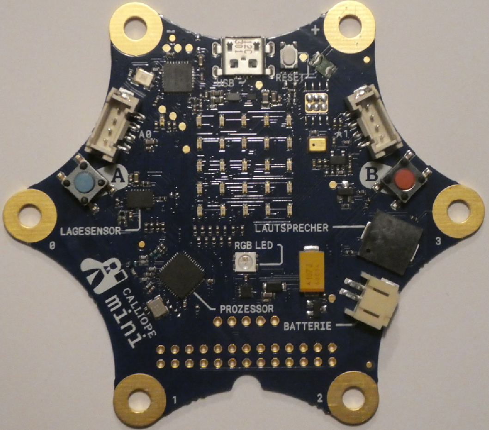
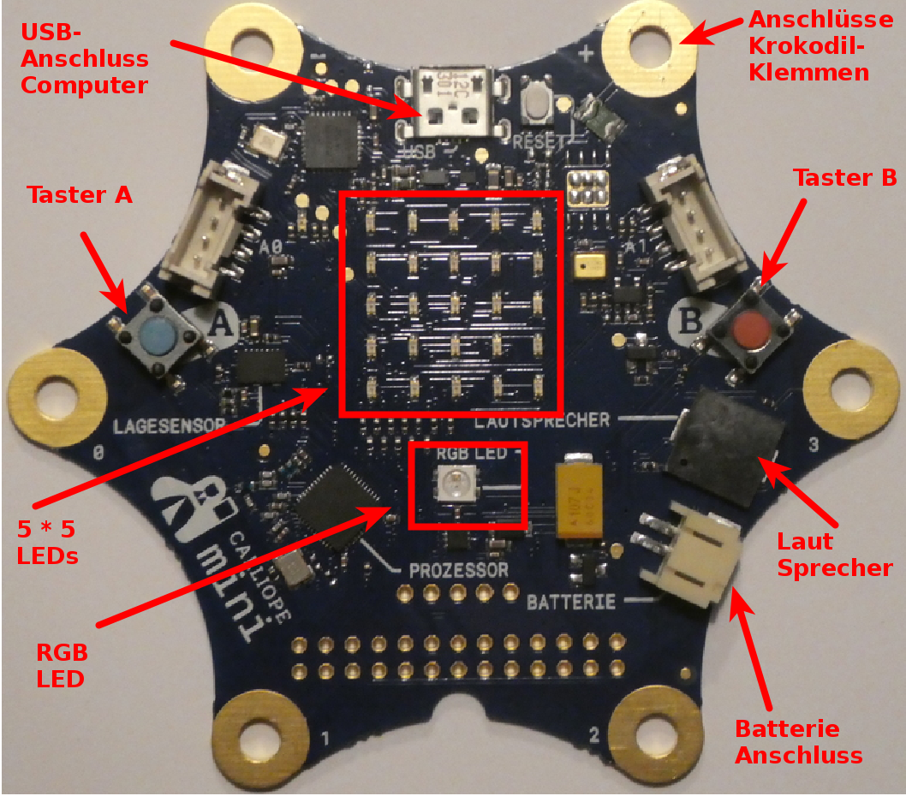
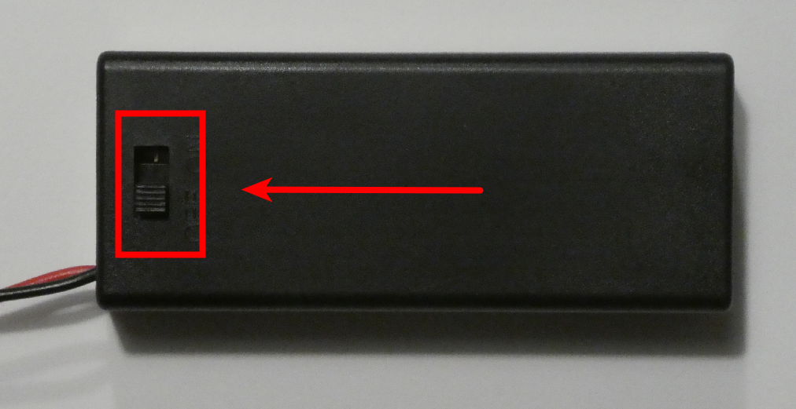
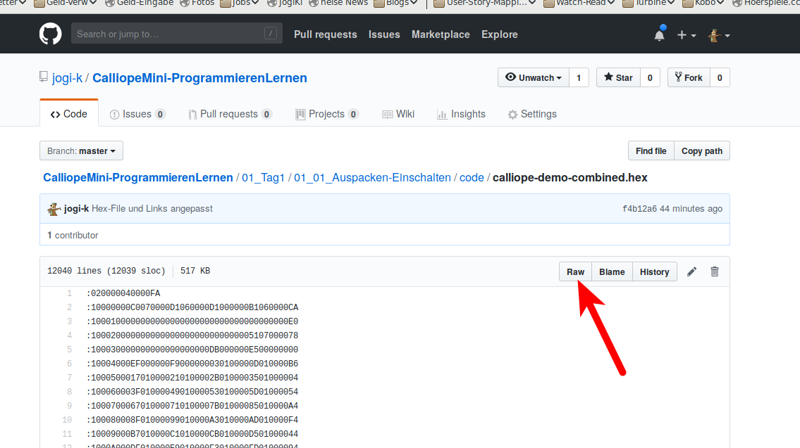
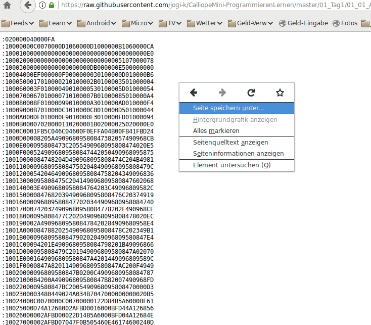

# Auspacken des Calliope und Erkunden

## Auspacken des Calliope

Das Paket enthaelt

* Den Calliope Mini selbst
* Ein Micro-USB-Kabel
* Ein Batterie-Fach
* 2 Batterien
* ~~2 Krokodil-Klemmen~~
* ~~2 LEDs~~ (war früher mit dabei...)
* Eine Anleitung

## Der Calliope Mini selbst

* Der Calliope, ausgepackt

## Calliope Mini : Was ist dran

* Der Calliope Mini, ausgepackt

## Batteriefach 

* Batterie einlegen 

* und Batteriefach zumachen
* Schalter ausschalten 

## Batterie anschliessen

* Das Kabel der Batterie anschliessen

## Anschluss - Nut

* Auf die Anschluss-Nut achten.

## Kabel-Nase in Anschluss - Nut

* Auf die Anschluss-Nut achten, die Nase des Kabels muss nach oben zeigen.

## Einschalten und Spielen

* Den Calliope mit dem Schalter am Batteriefach einschalten
* Etwas warten
* Vier verschiedene Spiele stehen zur Auswahl

    * Taste B : Spiel-Nr erhoehen
    * Taste A : Spiel-Nr verringern 
    * Calliope schuetteln : Spiel auswählen
    * Im Spiel : Beide Tasten drücken => Zurueck zum Menu

* Spiele-Auswahl
  
    1 Mini-Orakel
    2 Schere Stein Papier
    3 Funkt‘s
    4 Snake

* Beschreibung im Beilag-Heftchen

## Das Start-Programm 

Wenn Ihr im Verlauf des Programmier-Kurses das ursprüngliche Programm mit Euerem eigenen überschrieben habt (was ich hoffe), dann gibt es hier das ursprüngliche eingebaute Programm zum Download: 

### Herunterladen von HEX-Files aus dieser Plattform

Die Seite auf der Ihr Euch gerade befindet, ist eigentlich zum Austausch und Weiterentwicklen von Programmen gemacht, nicht als Plattform für Lern-Inhalte.   
Darum ist der Download der HEX-Files etwas komplizierter als gewöhnlich...
Wenn Ihr auf einen der Links auf ein HEX-File klickt, sieht das so aus:
 
 

Dort muss man nun auf den RAW-Button klicken um anschliessend dann folgende Ansicht zu bekommen, von der aus man das HEX-File mit einem Klick der rechten Maustaste herunterladen kann, mittels "Seite speichern"

 

Dazu speichert man die Seite am Besten z.B. als __ORIGINAL_START.HEX__ oder ähnlich.

Was man dann mit dem heruntergeladenen HEX-File anfangen kann, sehen wir in Teil 4 des heutigen Kurs-Tages.

### Der Source-Code

Wer Interesse daran hat, kann sich das auch selbst generieren, dazu sind aber andere Programmierwerkzeuge notwendig, wie die die wir im Kurs verwenden:
<https://github.com/calliope-mini/calliope-demo.git>

## Navigation

* [Hoch zur Übersicht](../README.md)  
* [Weiter ](../01_02_Start_Simulator/README.md)

## Lizenz/Copyright-Info
Für alle Bilder auf dieser Seite gilt:

*  Autor: Jörg Künstner
* Lizenz: CC BY-SA 4.0
