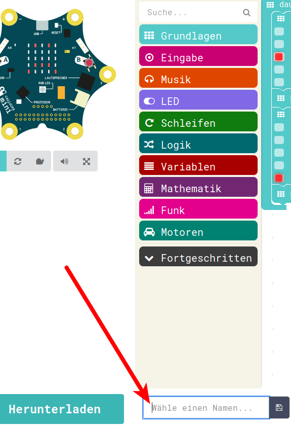
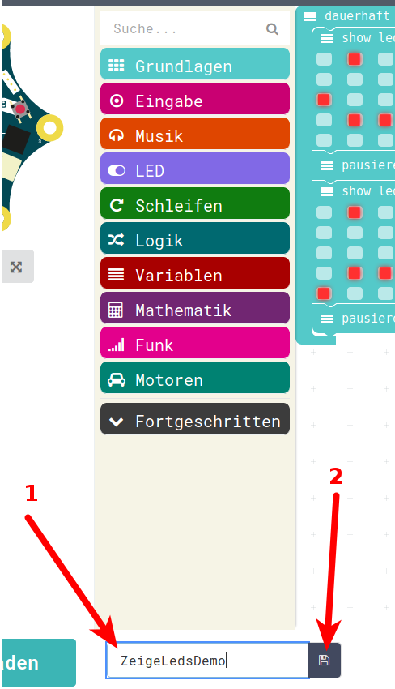
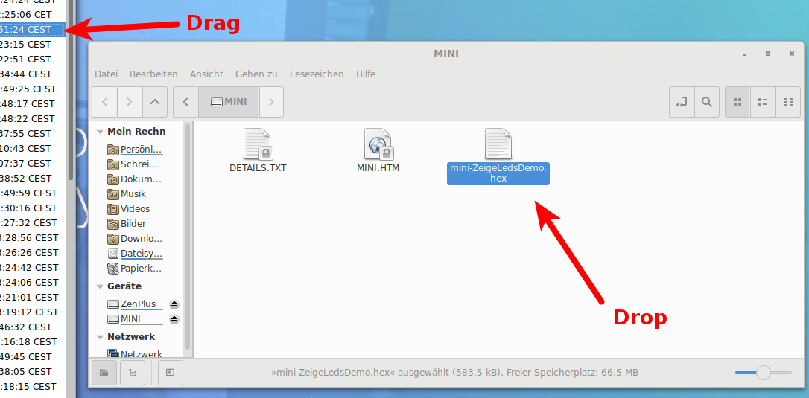
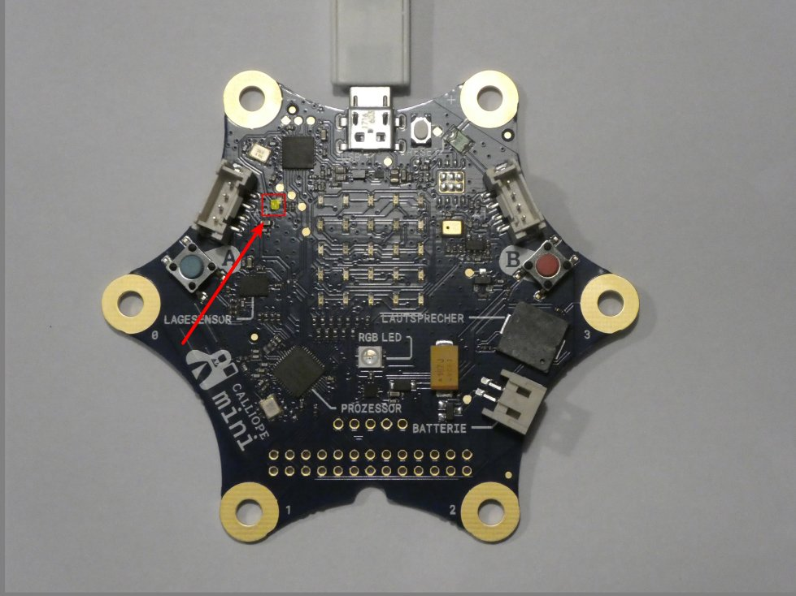

# Programm auf den Calliope laden

## Simulator 

Bislang haben alles "nur" im Browser gesehen, Code und Simulator.
Nun wollen wir aber unseren ersten Code auf dem Calliope laufen lassen.

## Namen vergeben

Dazu müssen wir als erstes unserem ersten Programm einen sinnvollen Namen geben:

{ height=60% }

## Speichern (1)

Nach der Eingabe eines sinnvollen Namens und klick auf das Disketten-Symbol 
(wer kennt noch Disketten?) 

{ height=60% }

## Speichern (2)

öffnet sich je nach Betriebs-System ein Speichern-Dialog, der es ermöglicht, das Programm als HEX-Datei auf der Festplatte abzulegen.
Die meisten Browser sind so konfiguriert, dass die Dateiein in einem Ordner namens "Downloads" abgelegt werden

{ height=60% }

## Speicher-Ort finden (1)

Da wir das aber nicht sicher wissen, kann man auch den Browser anweisen, einen zum Ort der heruntergeladenen Dateiein zu führen.

{ height=60% }

## Speicher-Ort finden (2)

In diesem Beispiel wurde die HEX-Datei im Verzeichnis "Downloads" des Benutzers "Jogi" abgelegt.

{ height=60% }

## Calliope Mini anstecken (1)

__ACHTUNG__

Vor Anstecken des Calliopes an einen USB-Port des Computers die Batterie-Spannung abschalten.
Besser noch die Batterien abstecken.
Der Calliope darf nicht gleichzeitig von den Batterien gespeist werden und am USB-Port des Computers per Kabel hängen!

## Calliope Mini anstecken (2)

Nach Anschluss des USB-Kabels an den Mini

{ height=70% }

## Calliope Mini anstecken (3)

und an einen USB-Port des Computers erscheint der Calliope Mini als USB-Speicher am Computer.

{ height=70% }

## HEX-Datei auf den Mini laden (1)

Nun kann man die Datei entweder mit der Maus per Drag and Drop auf den Mini ziehen:

* Datei mit der linken Maustaste anklicken, 
* Maustaste festhalten
* Datei auf das Ziel, also in unserem Fall den MINI

## HEX-Datei auf den Mini laden (2)

oder aber mit Kopieren/Einfügen (Maus) 

* Datei einmal mit der linken Maustaste anklicken, die Datei ist angewählt
* rechte Maustaste auf die Datei klicken
* Kopieren anwählen
* in einen freien Bereich im Ziel-Laufwerk mit der linken Maustaste klicken
* Einfügen wählen

## HEX-Datei auf den Mini laden (3)

oder aber mit Kopieren/Einfügen (Tastatur) 

* Datei einmal mit der linken Maustaste anklicken, die Datei ist angewählt
* STRG -Taste festhalten, C drücken (C wie Copy)
* in einen freien Bereich im Ziel-Laufwerk mit der rechten Maustaste klicken
* STRG-Taste festhalten, V drücken (V weil es direkt neben C ist)

{ height=50% }

## Das Programm wird "geflasht"

Vom Datenspeicher-Bereich des Calliopes wird es automatisch in den Programm-Bereich geflasht.
Das erkennt man an der blinkenden gelben LED

{ height=60% }

## Das Programm läuft

Wenn das Programm fertig geflasht ist, 

* dann resetet sich der Calliope automatisch, 
* er verschwindet kurz als USB-Laufwerk vom Computer 
* er erscheint wieder als USB-Laufwerk am Computer, aber das Programm ist verschwunden 
* dafür wurde es in den Programm-Speicher übertragen und 
* wird nun ausgeführt

{ height=50% }

## Navigation

* [Zurück](../01_03_LED_Anzeigen/index.html)  
* [Hoch zur Übersicht](../index.html)  
* [Weiter ](../01_05_Texte_Anzeigen/index.html)

## Lizenz/Copyright-Info
Für alle Bilder auf dieser Seite gilt:

*  Autor: Jörg Künstner
* Lizenz: CC BY-SA 4.0
