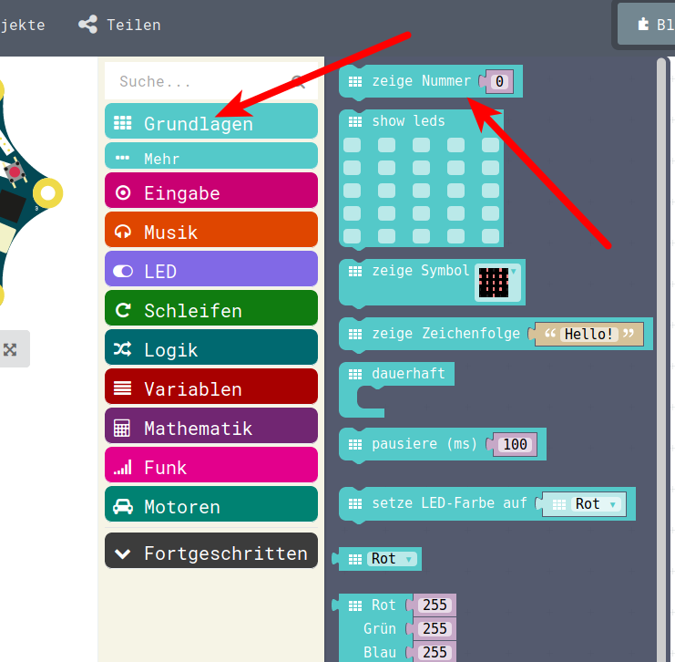
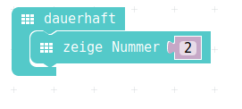
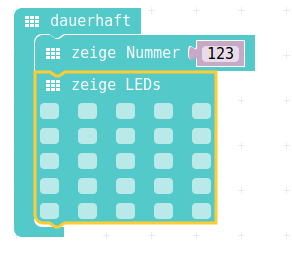

# Zahlen/Nummern anzeigen

## Zahlen / Nummern

In der Computer-Sprache unterscheidet man die Zeichenketten/Strings vom vorherigen Kapitel zu den Nummern/Zahlen.
Zeichenketten kann man anzeigen (und auch noch anders verändern) aber Nummern/Zahlen eignen sich zum Rechnen. 
Darum wird unterschieden zwischen Texten und Nummern. 

Wenn man Nummern, mit denen man später rechnen will, anzeigen will : => Nummern 


## Auswahl aus Menu

{height=70%}

## PXT-Code

Im ersten Schritt wollen wir nur eine einzelne Nummer anzeigen. 
In weiteren Schritten zeigen wir dann Zahlen an, die nicht am Stück auf das Display passen und schauen uns an, wie das angezeigt wird.

- Kleiner Tipp : Mit einem gelöschten Bildschirm (zeige LEDs ) und evt noch einen Pause ( pausiere ms ) lässt sich das dann besser identifizieren, was angezeigt wird.

## Einzelne Ziffer

{height=70%}


## Grosse Zahlen 

{height=70%}


## Grosse Zahlen mit Loeschen

{height=70%}


## Grosse Zahlen mit Loeschen und Warten

{height=70%}


## JavaScript-Code / HEX-Code

### JavaScript-Code

<details>
 <summary>Java-Script-Code</summary>

```js
basic.forever(() => {
    basic.showNumber(123)
    basic.clearScreen()
    basic.pause(1000)
})
```
</details>

### Download Hex-Code

[Hex-code](mini-NummernAnzeigen.hex)


# Ein Mini-Taschenrechner 

## Ein einfacher Taschenrechner

Nun kann man die Ausgabe von Texten und von Zahlen kombinieren und einen sehr sehr sehr einfachen Taschenrechner programmieren.

## Die Addition im Menu finden

Die Addition befindet sich - wie bei den Schulfächern - bei der Mathematik

 
{height=70%}


## Das vollständige Rechenprogramm

Nun ergibt eine Kombination der gerade gezeigten Zahlen-Ausgabe mit der Addition und der vorher gezeigten Zeichenketten-Ausgabe einen kleinen
"Taschenrechner".

{height=70%}


## JavaScript-Code / Hex-Code
### JavaScript-Code

<details>
 <summary>Java-Script-Code</summary>

```js
basic.forever(() => {
    basic.showString("2 + 5 =")
    basic.showNumber(2 + 5)
    basic.clearScreen()
    basic.pause(1000)
})
})
```
</details>

### Download Hex-Code

[Hex-code](mini-SimplerTaschenRechner.hex)

## Einschränkungen

Naja, das Rechnen ist doch etwas umständlich, der Calliope kann so nur genau eine Rechnung durchführen.  
Aber immerhin.  
Weiter geht es dann mit einem "echten" kleinen Rechner.


## Navigation


* [Zurück](../01_05_Texte_Anzeigen/README.md)  
* [Hoch zur Übersicht](../README.md)  
* [Weiter ](../01_07_Platzhalter/README.md)


## Lizenz/Copyright-Info
Für alle Bilder auf dieser Seite gilt:

*  Autor: Jörg Künstner
* Lizenz: CC BY-SA 4.0

