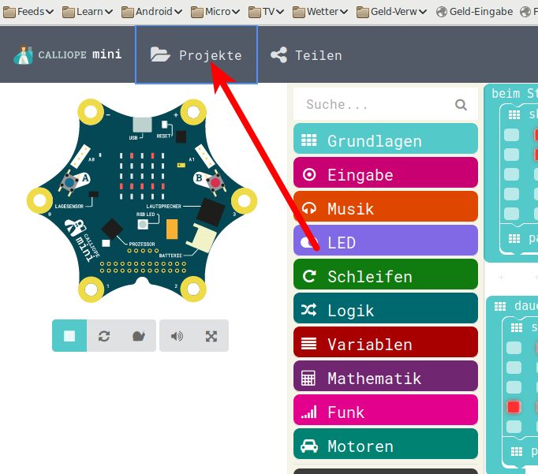
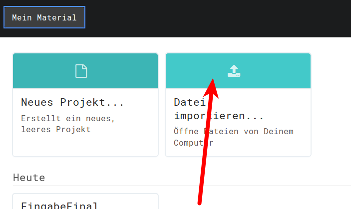
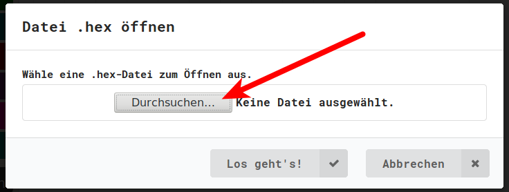
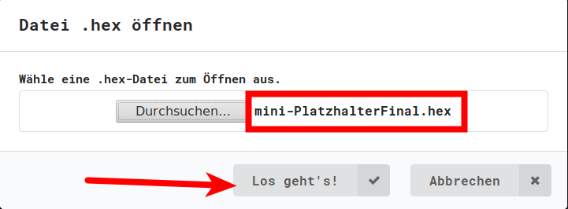
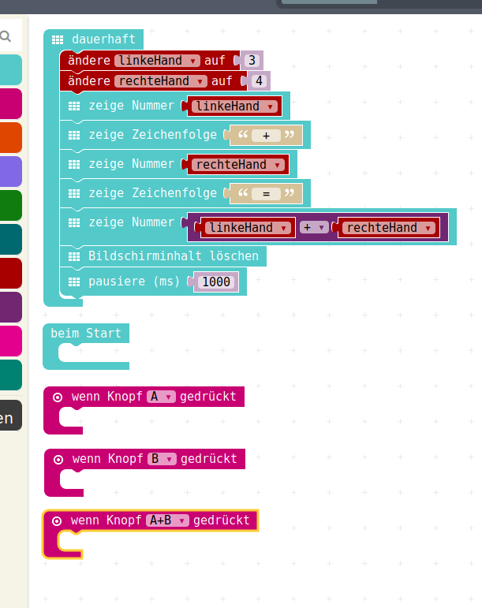
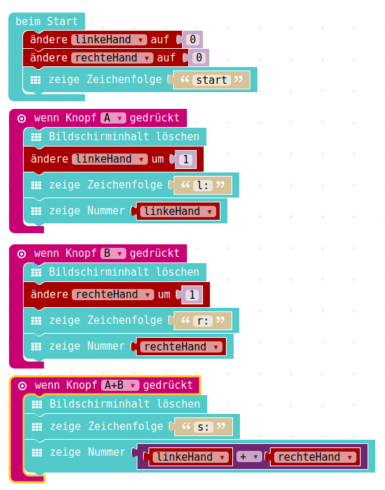

# Der Taschenrechner 

## Bisher gelernt (1)

Bis jetzt haben wir gelernt:

* Zeichen auf den LEDs anzeigen 
* Zahlen auf den LEDs anzeigen 
* Erster Umgang mit Platzhaltern
* Einfache Berechnung (+)
* Ausführen von Programm-Teilen einmalig beim Start
* Ausführen von Programm-Teilen immer
* Reaktion auf Tasten-Drücke

## Bisher gelernt (2)

Damit sollten wir eigentlich nun in der Lage sein, einen sehr einfachen Taschenrechner zu bauen.
Er soll: 

* Beim Start zwei Platzhalter mit 0 belegen
* Beim Drücken der linken Taste den einen Platzhalter um eins erhöhen und dessen Wert anzeigen (evt. noch vorher die Zeichenkette "l: " ausgeben)
* Beim Drücken der rechten Taste den anderen Platzhalter um eins erhöhen und dessen Wert anzeigen ( evt. auch hier noch die Zeichenkette "r: " ausgeben)
* Beim Drücken beider Tasten die Summe der beiden Platzhalter ausgeben ( evt. auch hier noch die Zeichenkette "s: " - wie Summe - ausgeben) 


## Laden des alten Berechnungs-Programms

Wir laden als Basis für unseren Taschenrechner das Programm aus Teil 01_06 : Platzhalter und bauen es entsprechend um.
Die Programme haben wir ja jeweils als HEX-Datei auf den Calliope geladen.  
Nun laden wir das HEX-File aus Teil 01_06 wieder in die Programmier-Oberfläche


## Projekte 



## Importieren



## Durchsuchen



## Durchsuchen

Das alte Programm (HEX-Datei) von der Platzhalter-Lektion suchen und anklicken.


## Laden



## Altes Programm ist geladen


## Erweitern des Programms 

Das Programm wird nun mit den entsprechenden Startbedingungen erweitert:

- Beim Start
- Wenn Knopf A gedrückt
- Wenn Knopf B gedrückt
- Wenn Knopf A+B gedrückt

{height=50%}


Die restliche Programm-Logik ist schon da oder oben beschrieben und wurde schon vorher gezeigt,  darum an dieser Stelle nur noch ein Hinweis und dann eine "Musterlösung".

## Platzhalter/Variablen , Achtung

Bei den Variablen befinden sich zwei sehr ähnlich klingende Befehle:
{height=50%}

* Der eine ist für die Belegung zum Beispiel beim Starten zuständig, er belegt die Variable mit einem konkreten Wert, er initialisiert die Variable __AUF__ den angegebenen Wert.
* Der andere Befehl nimmt den Wert in der Variable und ändert ihn __UM__ den angegebenen Wert, er führt also eine Berechnung mit dem Wert durch. Diesen Befehel brauchen wir beim Drücken der Tasten.

## Simulator : A+B drücken

Da man im Simulator nur einen Mouse-Zeiger hat und damit nicht gleichzeitig die beiden Tasten A+B klicken kann, 
blendet der Simulator bei Notwendigkeit eine zusätzliche "A+B"-Taste ein. 
Diese gibt es nur im Simulator, auf dem echten Calliope drückt man einfach beide Tasten gleichzeitig.

{height=50%}

 

## "Musterlösung"

Eine mögliche "Musterlösung"

{height=70%}


## JavaScript-Code

Finales Taschenrechner-Programm.   

<details>
 <summary>Java-Script-Code</summary>

```js
let rechteHand = 0
let linkeHand = 0
input.onButtonPressed(Button.A, () => {
    basic.clearScreen()
    linkeHand += 1
    basic.showString("l:")
    basic.showNumber(linkeHand)
})
input.onButtonPressed(Button.B, () => {
    basic.clearScreen()
    rechteHand += 1
    basic.showString("r:")
    basic.showNumber(rechteHand)
})
input.onButtonPressed(Button.AB, () => {
    basic.clearScreen()
    basic.showString("s:")
    basic.showNumber(linkeHand + rechteHand)
})
linkeHand = 0
rechteHand = 0
basic.showString("start")
```
</details>

## Download Hex-Code


## Navigation


* [Zurück](../01_08_TastenEingabe/README.md)  
* [Hoch zur Übersicht](../README.md)  


## Lizenz/Copyright-Info
Für alle Bilder auf dieser Seite gilt:

*  Autor: Jörg Künstner
* Lizenz: CC BY-SA 4.0


