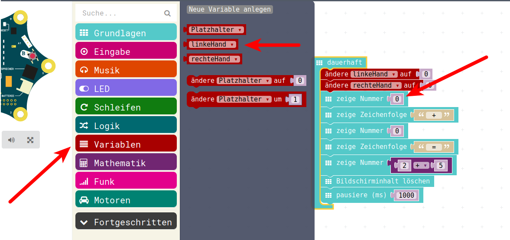
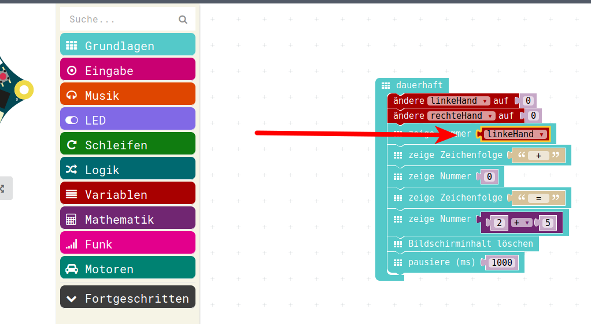

### Download Hex-Code

[Hex-code](mini-NummernAnzeigen.hex)


# Ein Mini-Taschenrechner 

## Ein einfacher Taschenrechner

Nun kann man die Ausgabe von Texten und von Zahlen kombinieren und einen sehr sehr sehr einfachen Taschenrechner programmieren.

## Die Addition im Menu finden

Die Addition befindet sich - wie bei den Schulfächern - bei der Mathematik


{height=70%}


## Das vollständige Rechenprogramm

Nun ergibt eine Kombination der gerade gezeigten Zahlen-Ausgabe mit der Addition und der vorher gezeigten Zeichenketten-Ausgabe einen kleinen
"Taschenrechner".

{height=70%}


## JavaScript-Code / Hex-Code
### JavaScript-Code

<details>
 <summary>Java-Script-Code</summary>

```js
basic.forever(() => {
    basic.showString("2 + 5 =")
    basic.showNumber(2 + 5)
    basic.clearScreen()
    basic.pause(1000)
})
})
```
</details>

### Download Hex-Code

[Hex-code](mini-SimplerTaschenRechner.hex)

## Einschränkungen

Naja, das Rechnen ist doch etwas umständlich, der Calliope kann so nur genau eine Rechnung durchführen.  
Aber immerhin.  
Weiter geht es dann mit einem "echten" kleinen Rechner.

## Erklärung (1)

Wenn man den Taschenrechner etwas universeller haben will, dann muss man mehr Flexibilität haben.  
D.h man muss mit verschiedenen, unterschiedlichen Werten arbeiten können.  
Anstatt den Programm-Code immer abzuändern und die Berechnung jedesmal neu zu übersetzen, brauchen wir sogenannte Platzhalter.
Platzhalter nennt man beim Programmieren auch Variablen, weil die Platzhalter unterschiedliche Werte, variable Werte aufnehmen kann.  
Das kann man sich z.B. beim einfachen Zählen mit zwei Händen vorstellen:  


Hier ist jetzt der Variable-Einschub schon gemacht


## Verwendung des Platzhalters 

{height=70%}

Verwendung der Variablen Ausgaben und Berechnungen anstatt fester Werte.

## Benutzung Platzhalter

{height=70%}

Dazu zieht man die Variable/den Platzhalter genau an die Stelle an der vorher feste Werte benutzt wurden.


## PXT-Code

Finales simples Taschenrechner-Programm.  
Immernoch muss Programm-Code geändert werden um eine neue Berechnung durchzuführen, aber die Werte für die Berechnung müssen nur an einer zentralen Stelle geändert werden.
Dank Verwendung von Platzhaltern/Variablen passt sich die Ausgabe jeweils entsprechend an.


## JavaScript-Code / HEX-Code

### JavaScript-Code

<details>
 <summary>Java-Script-Code</summary>

```js
let rechteHand = 0
let linkeHand = 0
basic.forever(() => {
    linkeHand = 3
    rechteHand = 4
    basic.showNumber(linkeHand)
    basic.showString(" + ")
    basic.showNumber(rechteHand)
    basic.showString(" = ")
    basic.showNumber(linkeHand + rechteHand)
    basic.clearScreen()
    basic.pause(1000)
})
```

</details>

### Download Hex-Code

[Hex-code](mini-PlatzhalterFinal.hex)

## 