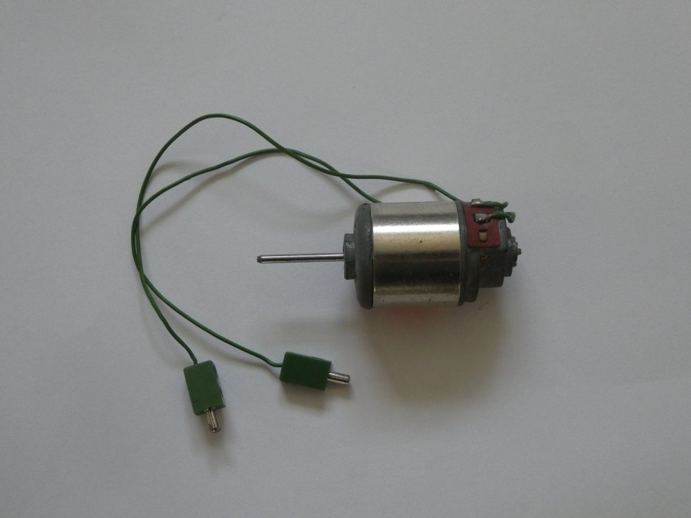
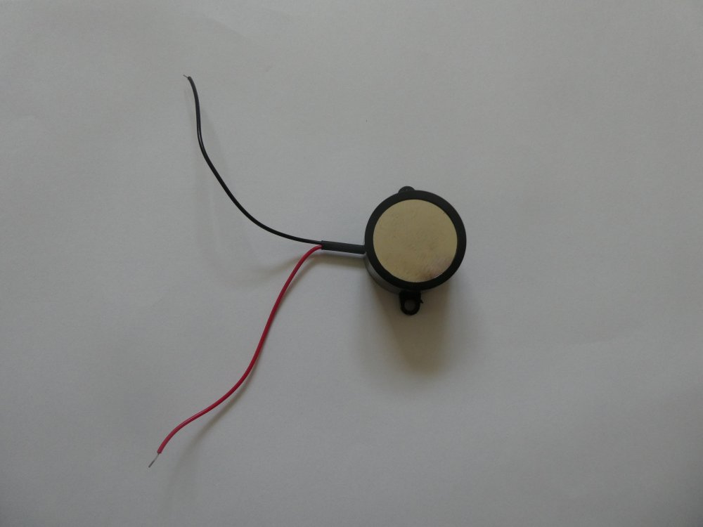
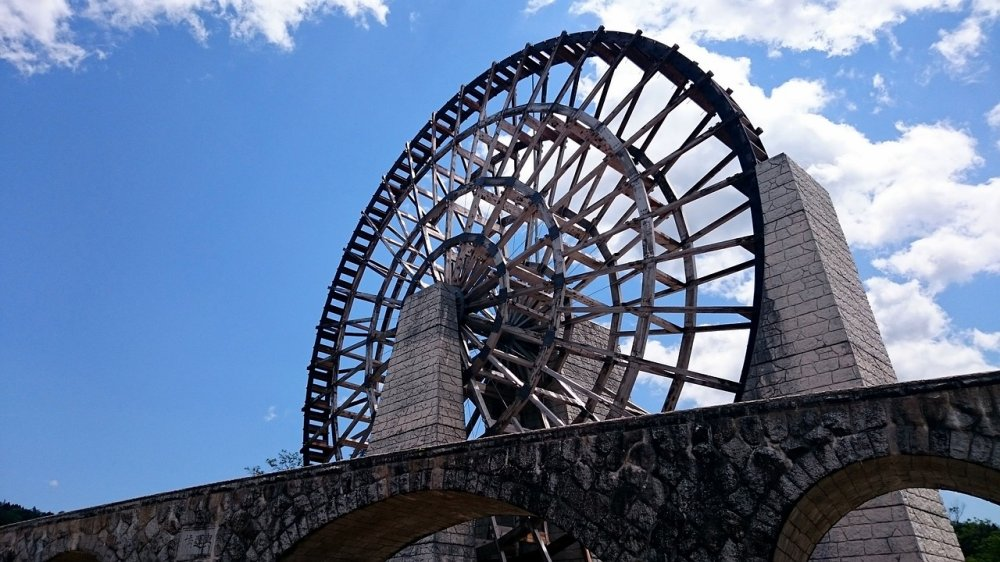
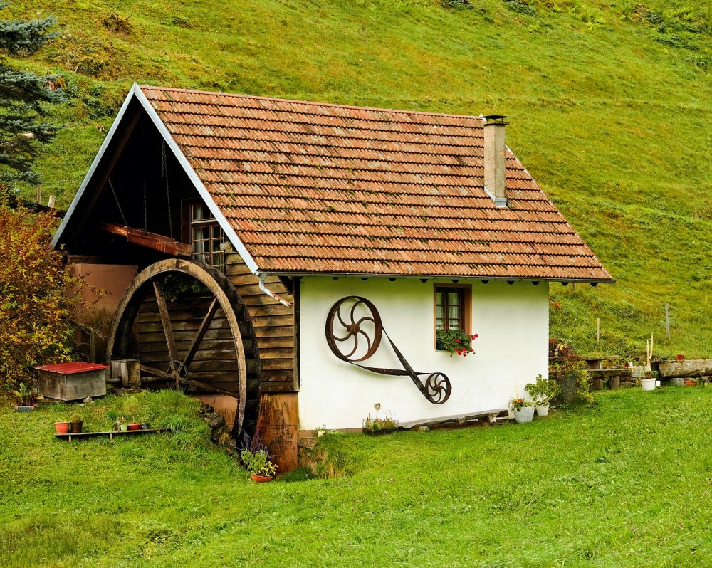

# Elektronik Grundlagen

## Verbraucher 

Eine Spannungsquelle alleine bringt noch gar nichts. 
Man will ja irgendetwas antreiben, sehen, erhitzen ...
Also z.B. 

* Einen Motor im Staubsauger antreiben
* Eine Lampe/Taschenlampe leuchten sehen
* Einen Toaster erwärmen
* ...

Das sind die sogenannten Verbraucher.  
Sie verbrauchen den Strom, den die Batterie liefert.   

Beispiele - für unsere Zwecke - von Verbrauchern:

##  Eine kleines Birnchen.

{height=60%} 

## Eine einzelne LED.

\colA{6cm}
{height=60%} 

\colB{6cm}
{height=60%}

\colEnd

## Ein kleiner Servo-Motor

{height=60%} 

## Ein kleiner Motor

{height=60%} 

## Ein "grässlicher" Summer 

{height=60%} 

## Auch zwei Anschlüsse 

Wie ihr vielleicht seht, haben auch die Verbraucher normalerweise 2 Anschlüsse, der Servo-Motor hat sogar 3, da gehen wir aber jetzt nicht weiter darauf ein.

Auch bei den Verbrauchern gibt es oft die Unterscheidung zwischen __+ Plus__ und __- Minus__. Darauf __muss__ man achten!

Manchmal funktioniert etwas einfach nicht, wenn man es falsch herum anschliesst, es kann aber auch schlimmer kommen und man macht den Verbraucher __kaputt__. Also Vorsicht beim Anschliessen der Verbraucher!

## Spannungs - Angaben

So wie bei den Spannungs-Quellen, die es in sehr unterschiedlichen Grössen gibt, muss man auch bei den Verbrauchern auf die Spannungs-Angaben und auf die Grössen achten.
Diese Lampen hier:

{height=60%} 

sind ausgelegt für Spannungen von 220 V (Achtung, Steckdose!) bis herunter zu 3 V. 

## Vergleich mit Wasser

Um auch hier wieder den Vergleich mit Wasser zu bringen, können wir uns die Verbraucher als Wasser-Räder vorstellen.

So wie bei den Spannungs-Quellen, den Wasserfällen, die es in sehr verschiedenen Grössen gibt, gibt es eben auch Wasser-Räder in sehr unterschiedlichen Grössen.

## Ein sehr grosses Wasserrad 

  {height=60%} 

\begin{tiny}
(https://pixabay.com/de/japan-waterwheel-826639 , CC0 Creative Commons )
\end{tiny}     

## Ein normales Wasserrad  
  {height=60%} 

\begin{tiny}
(https://pixabay.com/de/mhle-wasserrad-alt-wasserkraft-2909252 CC0 Creative Commons )
\end{tiny}     

## Ein kleines Wasserrädchen  
  {height=60%} 

\begin{tiny}
(https://pixabay.com/de/wasserrad-holz-bach-modell-778801 , CC0 Creative Commons )
\end{tiny}     

