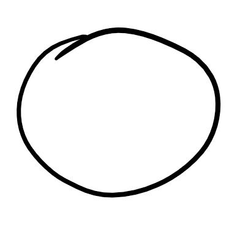
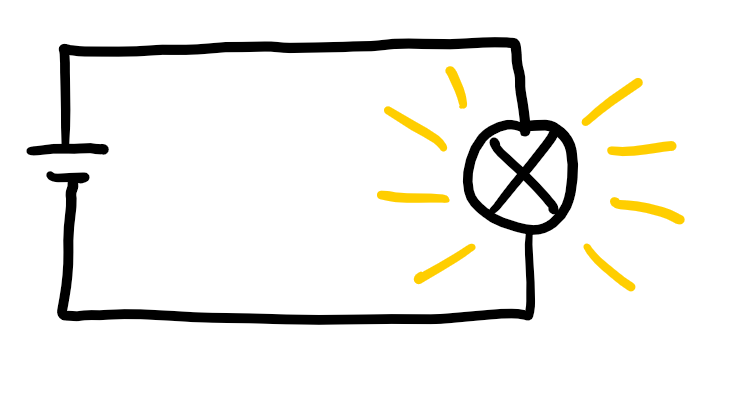
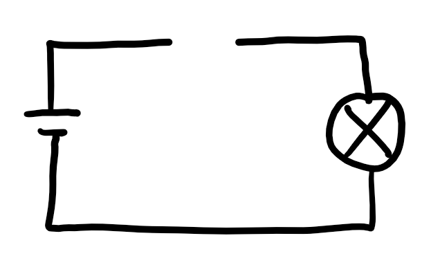
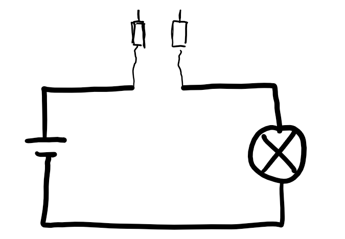
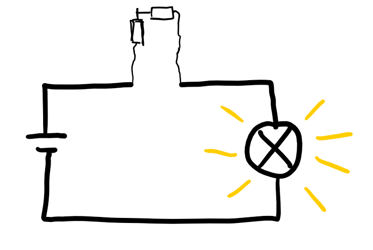
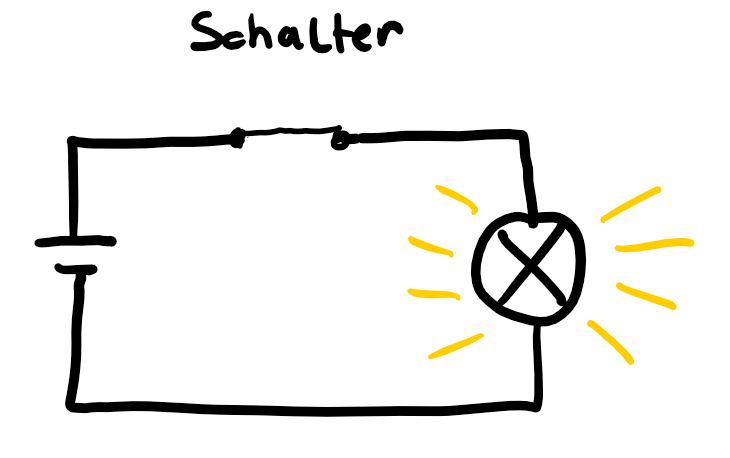
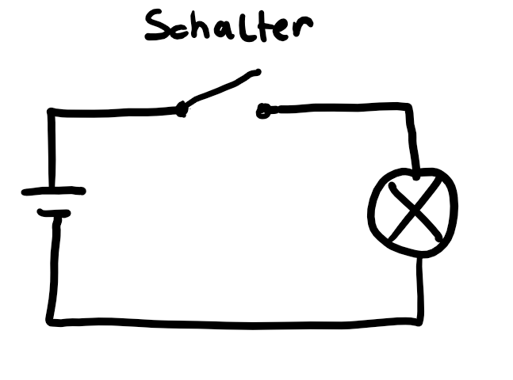
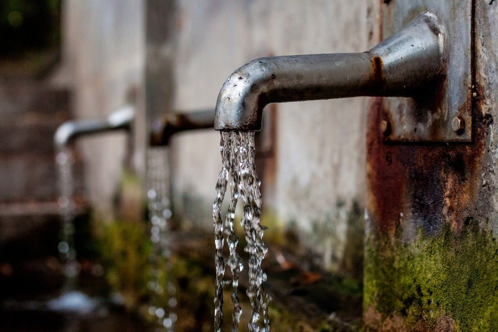

# Elektronik Grundlagen

## Der Stromkreis (1)

Im Stromkreis   

{height=60%}

(das ist natürlich kein Stromkreis, das ist ein Kreis) 

kommen nun die Spannungsquelle und der Verbraucher zusammen.

## Der Stromkreis (2)

* Hier zeichnen wir links die Batterie und rechts die Lampe.   
* Dafür gibt es aber keine "Vorschrift", man kann die Batterie auch auf der rechten Seite zeichnen.  
* Der Pluspol der Batterie wird mit einem Anschluss des Lämpchens verbunden, 
* der Minus-Pol der Batterie mit dem anderen Anschluss.
* Bei einem normalen (altmodischen) Glühlämpchen, ist es egal, welchen Anschluss des Lämpchens man mit Plus und welchen Anschluss man mit Minus verbindet.
* Bei einigen anderen Verbrauchern ist das nicht egal, darauf kommen wir später noch zurück.

## Der Stromkreis (3)

Als Kreis ist es natürlich etwas unpraktisch...

{height=60%}

Aber man kann sich - einmal so gezeichnet - den Kreis als Strom-Kreis ganz gut vorstellen.

## Der Stromkreis (4)

Normalerweise wird das mit geraden Strichen gezeichnet.

{height=60%}

Wenn der Stromkreis - so wie hier - geschlossen ist, dann leuchtet die Lampe

## Der Stromkreis (5)

Wenn der Stromkreis - so wie unten - offen ist, dann leuchtet die Lampe nicht.
Dies Leuchten der Lampe mit den gelben Strichen sieht man normalerweise in den Schaltbildern nicht!  
Aber wir sind ja hier am Lernen dieser Dinge, da darf man das schon reinmalen.

{height=60%}

## Der Stromkreis (6)

Nun kann man - __aber nur bei den niederen Spannungen mit denen wir arbeiten__ - zwei Kabel mit z.B. sogenannten "Bananen-Stecker" an die offene Stelle befestigen

{height=60%}

## Der Stromkreis (7)

Wenn man nun die beiden Bananenstecker verbindet, leuchtet die Lampe!

{height=60%}

## Der Stromkreis (8)

Praktischerweise gibt es dafür auch Bauelemente, um die beiden Kontakte zu verbinden. 

Das ist einfach ein __Schalter__!  

Schalter geschlossen : Lampe leuchtet

{height=60%}

## Der Stromkreis (9)

Schalter offen  : Lampe leuchtet nicht  

{height=60%}

## Der Stromkreis (10)

__Zusammenfassung__ : 

* Geschlossener Stromkreis: Verbraucher läuft/Lampe leuchtet 
* Offener Stromkreis: Verbraucher läuft nicht/Lampe leuchtet nicht
* Dass eine Lampe leuchtet/nicht leuchtet zeigt man normalerweise in einem elektronischen Bild __NICHT__ an, aber wir können das schon tun...

## Elemente müssen zusammenpassen

Wenn nun also Spannungs-Lieferant und Verbraucher zusammenkommen ist es sehr wichtig, dass diese zusammenpassen.

## Zu hohe Spannung (1) 

Wir möchten ja weder, dass die zu starke Spannungsquelle unseren Verbraucher zerstört:

\colA{6cm}

{height=60%}

\begin{tiny}
(https://pixabay.com/de/niagaraf%C3%A4lle-wasserfall-wasserkraft-218591 , CC0 Creative Commons)
\end{tiny}     

\colB{6cm}
{height=60%}

\begin{tiny}
(https://pixabay.com/de/wasserrad-holz-bach-modell-778801 , CC0 Creative Commons )
\end{tiny}     

\colEnd

Würde man versuchen, das kleine Wasserrad an den Niagara-Fällen zu betreiben, würde das Wasserrad das wohl nicht "überleben" 

## Zu geringe Spannung  (1) 

Ebenso möchten wir natürlich, dass sich unser Verbraucher "bewegt", oder leuchtet oder ...

\colA{6cm}
{height=60%}

\begin{tiny}
(https://pixabay.com/de/wasserhahn-brunnen-wasserspender-1684902 CC0 , Creative Commons) 
\end{tiny}     

\colB{6cm}
{height=60%}

\begin{tiny}
(https://pixabay.com/de/japan-waterwheel-826639 , CC0 Creative Commons )
\end{tiny}     

\colEnd

Das Wasser aus diesem Mini-"Wasserfall" wird sicher unsere grosses Wasserrad nicht antreiben können.

## Zu geringe Spannung  (2) 

Dieser Fall ist allerdings sowohl bei unserem Wasservergleich als auch beim Arbeiten mit Stromkreisen im Allgemeinen der weniger schlimme Fall:  

Unser Verbaucher wird wahrscheinlich einfach gar __nicht__ oder nicht ganz wie erhofft __arbeiten__.

## Zusammenfassung

* Im Stromkreis müssen die Verbraucher und die Spannungs-Quelle die selben Spannungen aufweisen, um sinnvoll zu funktionieren.
* Ist die Spannungsquelle zu gross, wird ziemlich sicher irgendetwas zerstört werden. 
* Ist die Spannungsquelle zu klein, wir meist nichts passieren, aber auch nichts "funktionieren"

## Lizenz/Copyright-Info
Für alle Bilder auf diesen Seiten/Folien, soweit nicht unter dem Bild anders gekennzeichnet,  gilt:

*  Autor: Jörg Künstner
* Lizenz: CC BY-SA 4.0
