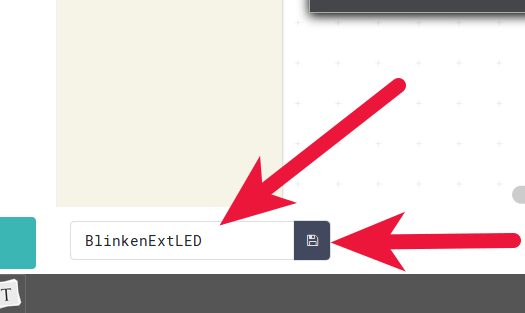
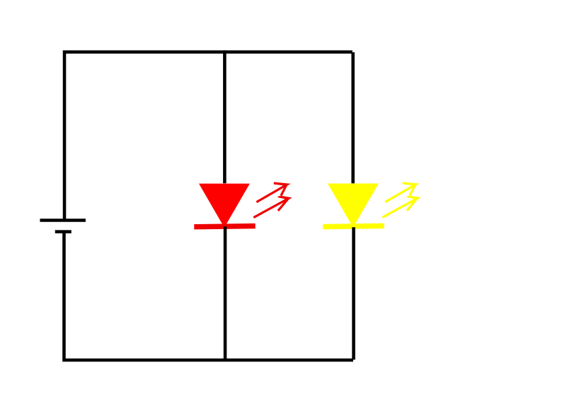
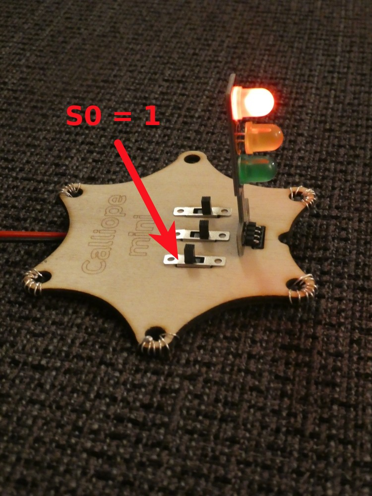
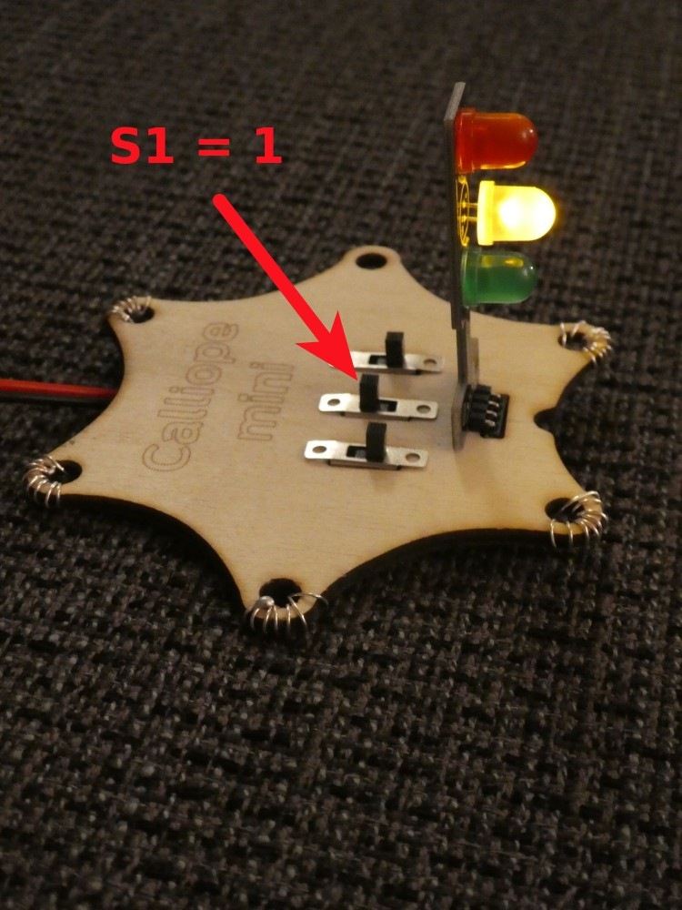
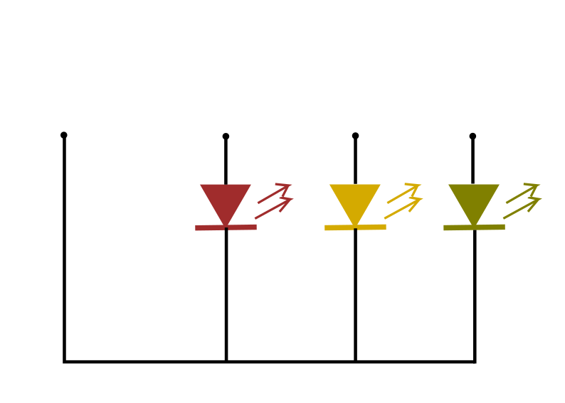
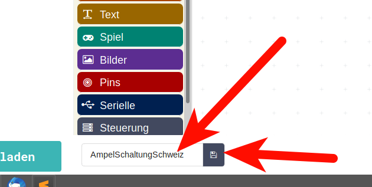

# Externe LEDs ansteuern

## Nochmals: Spannungen (1)

Der Grund, warum wir uns überhaupt in den letzen Minuten/letzte halbe Stunde mit Elektronik-/Elektrotechnik-Grundlagen beschäftigt haben, ist folgender:

Der Calliope hat schon sehr viele Dinge (die wir auch noch genauer anschauen werden) auf dem Board. Aber manchmal reicht das nicht und man will etwas an den Calliope anschliessen.

Und damit man dabei weder den Calliope, noch das was man anschliesst, zerstört, haben wir ein paar Basis-Dinge gelernt.,

## Nochmals: Spannungen (2)

- Wenn Spannung von Lieferant und Verbraucher nicht übereinstimmen, dann funktioniert es nicht.
- Wenn die Spannung vom Lieferanten höher ist als das, was der Verbraucher "verträgt", dann muss damit gerechnet werden, dass der Verbraucher kaputtgeht.
- Wenn die Spannung vom Lieferant kleiner ist, als das was der Verbraucher braucht/verträgt, dann ist i.A. der Schaden klein, es funktioniert einfach nicht!
- Wenn man an den falschen Stellen Kabel zusammenbringt, dann verursacht man einen Kurzschluss.
- Ein Kurzschluss führt dazu, dass viel Strom fliesst, was im guten Fall nur die Batterie erwärmt, im schlechten Fall geht dabei der Calliope kaputt oder die Batterie wird zu warm und fängt Feuer!

__Also Vorsicht !__

Wir werden nun also die Anschlüsse des Calliope ausprobieren.

## Das offizielle Calliope-Layout

So sieht das offizielle Layout des Calliope aus:  

{height=80%}

\begin{tiny}
  (https://calliope-mini.github.io/assets/v10/img/Calliope\_mini\_1.0\_pinout\_fin.jpg)
\end{tiny}

## Fähigkeiten der Pins

Wenn man die Anschlüsse auf dem Calliope etwas genauer anschaut, dann sieht man an

- P0: Digital und Touch
- P1: Digital, Analog und Touch
- P2: Digital, Analog und Touch
- P3: Digital und Touch

## Pins als Ausgang oder Eingang

Wichtig ist an dieser Stelle:  
Die __Pins__ kann man vom Programm aus sowohl als __Ausgang__ schalten, d.h. wir können z.B, eine LED ein und ausschalten, als auch  kann man die __Pins__ als __Eingang__ schalten, sprich man kann vom Programm aus abfragen, ob von aussen eine Spannung angelegt wurde, ob der Eingang mit dem Finger berührt wurde und ähnliches.

## Pins als Ausgang oder Eingang II

### Ausgang
* Pin als __AUSGANG__ : Calliope __schaltet__ etwas ein und aus, z.B. eine __LED__
* In der Fachsprache : Calliope __schaltet__ einen __Aktor__

### Eingang

* Pin als __EINGANG__ : Calliope __reagiert__ auf eine Änderung, z.B. einen __Taster/Schalter__ 
* In der Fachsprache : Calliope __reagiert__ auf einen __Sensor__ 

## Externe LED ansteuern

Wir werden nun LEDs an die Anschlüsse anschliessen und schauen, ob wir die LEDs selbst ansteueren können.

{height=50%}

## Die Ampel

{height=70%}

So sieht unsere Ampel aus. Sie hat drei LEDs, die einzeln geschaltet werden können. Sie sind am Minus-Pol (=GND) verbunden

## Schaltbild

{height=80%}

## Angeschlossen mit Krokos

{height=80%}

## Menu : Fortgeschritten

{height=80%}

## Menu Pins 

{height=80%}

## Schreibe digitalen Wert

{height=80%}

## Ein einfacher Blinker 

{height=60%}

## Blinker abspeichern

{height=50%}

* Das Programm unter dem Namen : __BlinkenExtLED__ abspeichern
* Das Programm in den __Calliope laden__
* Geht's ?
* Auch mal die anderen LEDs testen 
* Gleicher Pin am Calliope, anderer an der LED

## Eine Ampel

Wir möchten gerne eine Ampel haben, die folgendes ermöglicht:

{height=60%}

## Ohne Calliope 1

{height=80%}

Wir brauchen eine Batterie

## Ohne Calliope 2

{height=80%}

Wir brauchen eine rote LED

## Ohne Calliope 3

{height=80%}

Wir brauchen eine gelbe LED

## Ohne Calliope 4

{height=80%}

Wir brauchen eine grüne LED

## Ohne Calliope 5

{height=80%}

Wir trennen Grün auf

## Ohne Calliope 6

{height=80%}

Wir trennen Gelb auf

## Ohne Calliope 7

{height=80%}

Wir trennen Rot auf

## Ohne Calliope 8

{height=80%}

Wir bauen Schalter ein (S0 - S2)  
(Beim Computer wird meist bei 0 anstatt bei 1 angefangen zu zählen...)

## Ohne Calliope 9

{height=80%}

Schalter S0 einschalten : Rot 

## Ohne Calliope 10

{height=80%}

Schalter S1 einschalten : Gelb

## Ohne Calliope 11

{height=80%}

Schalter S2 einschalten : Grün

## Ohne Calliope 12

\colA{7cm}

{height=80%}

\colB{5cm}

{height=80%}

\colEnd

Schalter S0 einschalten : Rot 

## Ohne Calliope 13

\colA{7cm}

{height=80%}

\colB{5cm}

{height=80%}

\colEnd

Schalter S1 einschalten : Gelb

## Ohne Calliope 14

\colA{7cm}

{height=80%}

\colB{5cm}

{height=80%}

\colEnd

Schalter S2 einschalten : Grün

## Wie die Ampel funktioniert

* Alle Schalter aus $\Rightarrow$ Alle Lampen aus
* S0 = 0 : Rot aus
* S0 = __1__ : Rot __ein__
* S1 = 0 : Gelb aus
* S1 = __1__ : Gelb __ein__
* S2 = 0 : Grün aus
* S2 = __1__ : Grün __ein__

## Ein Ampel-Zyklus (1)

\colA{7cm}

* Alle Lampen aus
* Rot ein  $\Rightarrow$ __Ampel Rot (1)__
* Rotzeit abwarten (z.B. 5 sek) 
* Gelb ein $\Rightarrow$ __Ampel Rot-Gelb (2)__
* Rot-Gelbzeit warten (z.B. 1 sek) 
* Rot aus
* Gelb aus
* Grün ein $\Rightarrow$ __Ampel Grün (3)__
* Grünzeit warten (z.B. 5 sek)
* Grün aus 
* Gelb ein $\Rightarrow$ __Ampel Gelb (4)__
* Gelbzeit warten (z.B. 1 sek)
* Wieder von vorne

\colB{5cm}

{height=60%}

\colEnd

## Ein Ampel-Zyklus (2)

\colA{6cm}

* Alle Lampen aus
* Rot ein $\Rightarrow$ __Ampel Rot__
* Rotzeit abwarten (z.B. 5 sek) 
* Gelb ein $\Rightarrow$ __Ampel Rot-Gelb__
* Rot-Gelbzeit warten (z.B. 1 sek) 
* Rot aus
* Gelb aus
* Grün ein $\Rightarrow$ __Ampel Grün__
* Grünzeit warten (z.B. 5 sek)
* Grün aus 
* Gelb ein $\Rightarrow$ __Ampel Gelb__
* Gelbzeit warten (z.B. 1 sek)
* Wieder von vorne

\colB{6cm}

* S0,S1,S2 =0 $\Rightarrow$ Lampen aus
* S0=1  $\Rightarrow$ __Ampel Rot__
* Rotzeit abwarten (z.B. 5 sek) 
* S1=1  $\Rightarrow$ __Ampel Rot-Gelb__
* Rot-Gelbzeit warten (z.B. 1 sek) 
* S0=0
* S1=0
* S2=1 $\Rightarrow$ __Ampel Grün__
* Grünzeit warten (z.B. 5 sek)
* S2=0 
* S1=1 $\Rightarrow$ __Ampel Gelb__
* Gelbzeit warten (z.B. 1 sek)
* Wieder von vorne

\colEnd

## Ein Ampel-Zyklus (3)

\colA{7cm}

* S0,S1,S2 =0 $\Rightarrow$ Lampen aus
* S0=1  $\Rightarrow$ __Ampel Rot (1)__
* Rotzeit abwarten (z.B. 5 sek) 
* S1=1   $\Rightarrow$ __Ampel Rot-Gelb (2)__
* Rot-Gelbzeit warten (z.B. 1 sek) 
* S0=0
* S1=0
* S2=1 $\Rightarrow$ __Ampel Grün (3)__
* Grünzeit warten (z.B. 5 sek)
* S2=0 
* S1=1 $\Rightarrow$ __Ampel Gelb (4)__
* Gelbzeit warten (z.B. 1 sek)
* Wieder von vorne

\colB{5cm}

{height=60%}

\colEnd

## Ersetzen Hardware

\colA{7cm}

Wir ersetzen Schalter

{height=50%}

\colB{5cm}

Durch den Calliope

{height=50%}

\colEnd

## Ersetzen Software : Schalter S durch Pin P

\colA{7cm}

* S0,S1,S2 =0 $\Rightarrow$ Lampen aus
* S0=1  $\Rightarrow$ __Ampel Rot (1)__
* Rotzeit abwarten (z.B. 5 sek) 
* S1=1   $\Rightarrow$ __Ampel Rot-Gelb (2)__
* Rot-Gelbzeit warten (z.B. 1 sek) 
* S0=0
* S1=0
* S2=1 $\Rightarrow$ __Ampel Grün (3)__
* Grünzeit warten (z.B. 5 sek)
* S2=0 
* S1=1 $\Rightarrow$ __Ampel Gelb (4)__
* Gelbzeit warten (z.B. 1 sek)
* Wieder von vorne

\colB{5cm}

{height=80%}

\colEnd

## Anschluss LEDs (1)

{height=70%}

## Anschluss LEDs (2)

{height=70%}

## Anschluss LEDs (3)

{height=70%}

## Anschluss LEDs (4)

{height=70%}

## Anschluss LEDs (5)

\colA{7cm}

{height=70%}

\colB{5cm}

{height=80%}

\colEnd

## Vollständige Ampel

{height=80%}

## Vollständige Ampel mit Krokos

{height=80%}

## Einfaches Ampel-Programm

{height=80%}

## Ampel-Programm speichern

{height=60%}

* Speichern unter dem Namen : __AmpelSchaltungSchweiz__
* In den __Calliope laden__

## Österreichische Ampel

Wer war schon mal in Österreich?   

Da sieht die Ampel-Schaltung ein kleines bisschen anders aus:

<https://www.youtube.com/watch?v=dnmarj_TWDc>

## Österreichische Ampel Programm

{height=80%}

## Österreichische Ampel speichern

{height=60%}

* Speichern unter dem Namen __AmpelSchaltungOesterreich__
* In den __Calliope laden__

## Lizenz/Copyright-Info

Für alle Bilder auf diesen Seite/Folien, soweit nicht unter dem Bild anders gekennzeichnet,  gilt:

- Autor: Jörg Künstner
- Lizenz: CC BY-SA 4.0

