# Teil 1 : "Musterlösung" 

__ACHTUNG__: Das "Musterlösung" ist mit Absicht in Hockomma/Gänsefüsschen gesetzt.  
Beim Programmieren gibt es __NICHT__ die eine, richtige Lösung.  
Viele verschiedene Lösungen erledigen das selbe, darum ist die __Musterlösung__ eine von vielen möglichen!  
Wir werden aber zum Teil sogar unterschiedliche Varianten anschauen, um zu zeigen, dass es verschiedene Möglichkeiten gibt.

## Knopfdruck / Eingabe
 
* Beim __Drücken__ der linken Taste => __Menu Eingabe__   

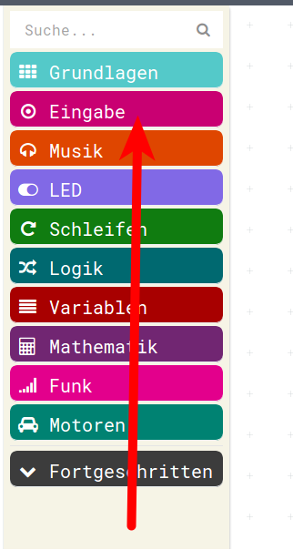

* Dort gibt es eine "Schleife" : __Wenn Knopf A gedrückt__
* So wie in unserer Standard-Schleife alle Befehle __immer__ ausgeführt werden, wird diese Schleife auch gleich benutzt 
* nur werden eben die Befehle beim Drücken der Taste __nur einmal__ durchgeführt

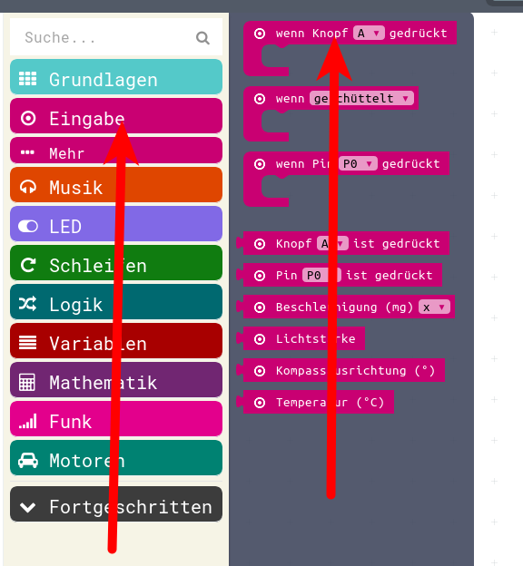

## Platzhalter/Variablen

*  __zwei Platzhalter__ => __Menu Variablen__  

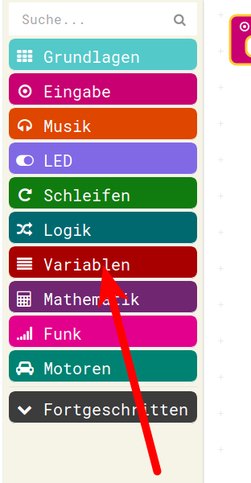

* Variablen müssen angelegt werden => __Neue Variable anlegen__ ( sinnvolle Namen vergeben )

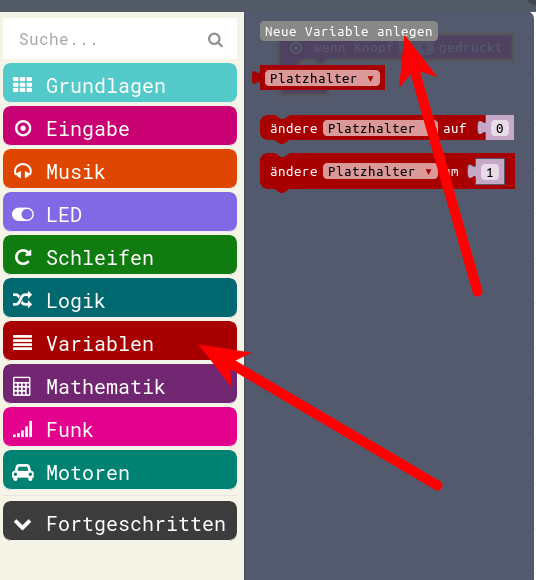

* Das Anlegen einer neuen Variable
* Zuerst "Wert1"

* Wie man sieht ist nun die Variable Wert1 angelegt.
* Nun wird nochmal via __Neue Variable anlegen__ eine Variable angelegt

* Wert2 wird angelegt

* Wert2 ist angelegt worden
* Nun haben wir die zwei neuen Variablen : Wert1 und Wert2 im Varibalen-Menu zur Verfügung

* __Achtung Falle__ : 
* Wir wollen zuerst die beiden neuen Variablen mit Zufallswerten "beschreiben"
* Die Puzzleteile sind aber __Lesen__ der Variablen!

* Darum holen wir uns anstatt dessen das Puzzleteil zum __Schreiben/Setzen__ der Variablen aus dem Menu
* Da gibt es allerdings __kein Puzzleteil__, das uns direkt das Schreiben des __Wert1__ erlaubt

* Darum müssen wir dieses mit "Platzhalter" nehmen und dann den Platzhalter in unsere Variable __Wert1__ abändern
* Das geschieht durch Klick auf das __kleine Dreieck__ neben dem Namen __Platzhalter__

* Dadurch öffnet sich eine sogenanntes Drop-Down-Menu, dieses enthält unsere beiden Variablen Wert1 und Wert2

* Wenn diese beiden Änderungen für unsere zwei Variable Wert1 und Wert2 gemacht sind, dann sieht unsere erstes Programm-Fragment so aus. 

## Zufallswerte

*  Zufallswerte befinden sich im  => __Menu Mathematik__  

* Dort gibt es einen Zufallsgenerator, der zwischen 0 und irgendwas erzeugt

* Diesen Befehl holen wir uns jetzt zweimal in die Arbeitsfläche

Der Zufallszahlen-Generator erzeugt zwischen 0 ... irgendwas, wir wollen 1 ... 10  
* Also erzeugen wir zwischen 0 ... 9 , und werden dann noch 1 drauf addieren. 
* So sieht es aus, wenn der Zufall eingeklickt ist und die grösste Zahl noch auf 9 korrigert ist

## Werte erhöhen

* Um den um eins zu niedrigen Zufallswert zu korrigieren, muss man eine __1 addieren__
* Dazu gibt es 2 Möglichkeiten
    * entweder anschliessend : __ändere Platzhalter um__
    * direkt beim belegen, durch Mathematik, es gibt ein __Additions__ Puzzle-Teilchen, das man verwenden kann.
* WIr werden hier beide Möglichkeiten benutzen, um sie zu zeigen.
* Im Normalfall entscheidet man sich für eine Möglichkeit und verwendet diese dann immer...

* Variante 1: Variable anschliessend erhöhen via __Ändere Platzhalter um 1__

* Auch hier gibt es diesen Befehl __NICHT__ mit Wert1 oder Wert2 sondern wir verwenden den mit "Platzhalter" und ändern anschliessend wieder via "Drop-Down-Menu" (Kleines Dreieck) 

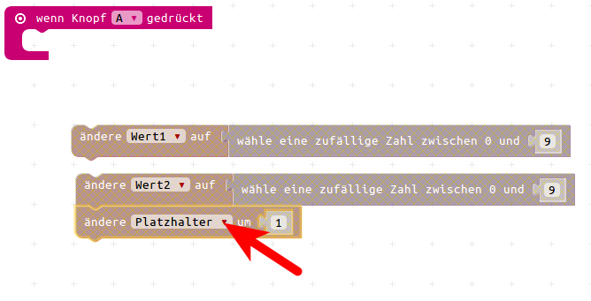

* Variante 2: Variable direkt beim Zuweisen durch eine Addition mit 1 
* Dazu holen wir eine Addition aus dem Menu Mathematik  

* Wir ziehen den Zufall nach oben als erste Zahl in die Addition rein
* Den anderen Teil der Addition belegen wir mit 1

* Anschliessend können wir die gesamte Addition wieder in die Variablen-Zuweisung reinziehen.

* Dann sieht das Gesamtergebnis so aus:

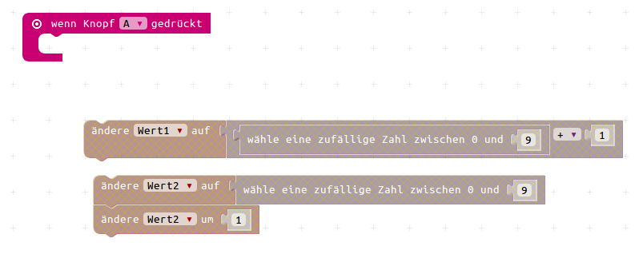

* Wert1 = Zufallszahl zwischen 0...9 und gleich 1 dazu addiert
* Wert2 = Zufallszahl zwischen 0...9
* Wert2 wird erhöht um 1

## Zeichen und Zahlen anzeigen

* Zahlen und Texte anzeigen finden sich im Menu __Grundlagen__  

* Dort verwenden wir:

 
* Zahlen __angezeigen__ macht man mit __Zeige Nummer__
* Texte, die angezeigt werden sollen ( das "="-Zeichen, das "+"-Zeichen) werden mit __zeige Zeichenfolge__ als Laufschrift angezeigt

* Also holen wir uns zweimal "zeige Nummer" und zweimal "zeige Zeichenfolge" in den Arbeitsbereich.

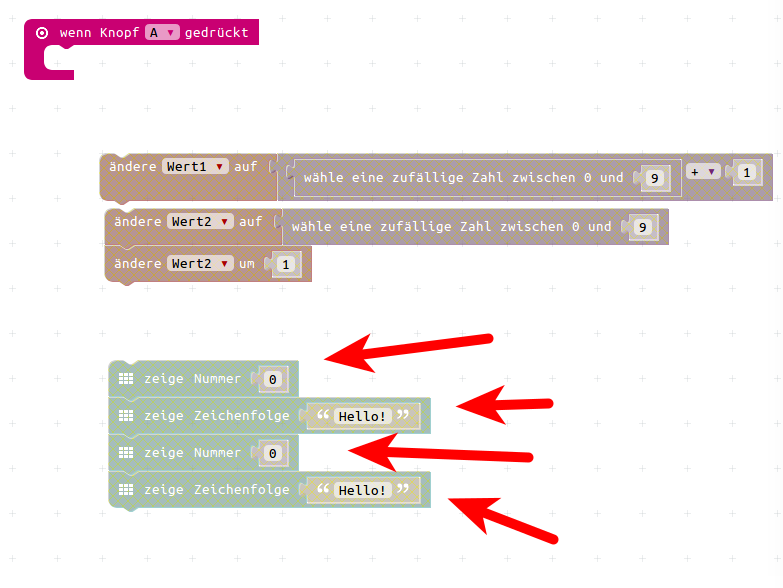

* Nun wollen wir - im Vergleich zu vorher - die Variablen lesen um sie anzuzeigen.
* Nun können wir also aus dem "Variablen" - Menu die beiden Variablen "Wert1" und "Wert2" auf den Arbeitsplatz ziehen.

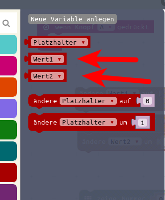

* Wenn wir sie auf dem Arbeitsplatz liegen haben, können wir sie jeweils in die Befehle "zeige Nummer" reinziehen, dort ersetzen sie jeweils die vorbelegte "0"

* Wenn wir nun noch die beiden Texte "*" und "=" in die Zeichenketten reinschreiben, dann sind wir eigentlich auch schon fertig.

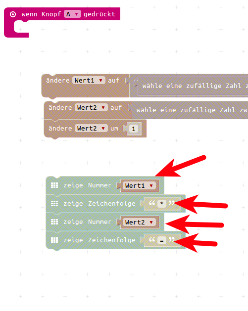

* Wir ziehen alles so in unsere Arbeits-Endlosschleife rein und schauen uns im Simulator an, was passiert. 

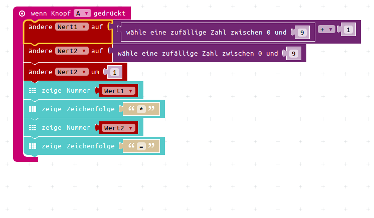

* Wenn man das im Simulator laufen lässt und mittels Klick auf die Taste startet, sieht es ganz gut aus, nur das Multiplikations-Zeichen "*" sieht man nicht.
* die unterschiedlichen LED-Ausgabe-Funktionen sind unterschiedlich schnell, darum muss man nach dem zeige Zeichenkette noch eine Pause einbauen
* So sieht dann das fertige Programm Teil 1 aus:

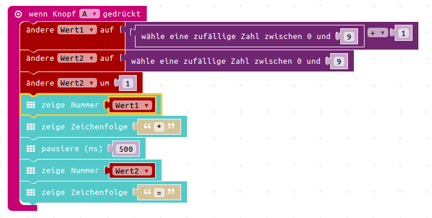

* Das können wir nun im Simulator ausprobieren und auch in den Calliope laden und uns daran erfreuen.
* Leider ist es nur de erste Teil, ob wir richtig gerechnet haben, können wir damit noch nicht überprüfen, aber wir können uns schonmal Zufalls-Zahlen als Rechenaufgabe geben lassen.

## Navigation

* [zurück zu Teil2 Hinweise](../03_01_Teil1_Hinweise/README.md)  
* [Hoch zur Übersicht](../README.md)  
* [weiter zu Teil2 Hinweise](../03_03_Teil2_Hinweise/README.md)  

## Lizenz/Copyright-Info
Für alle Bilder auf dieser Seite gilt:

*  Autor: Jörg Künstner
* Lizenz: CC BY-SA 4.0
