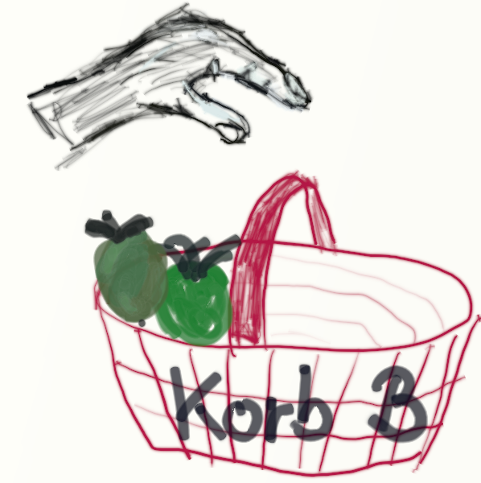
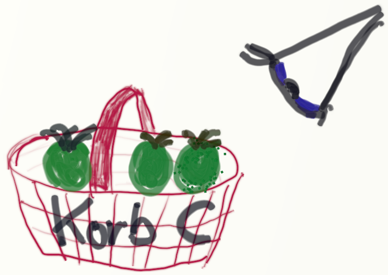
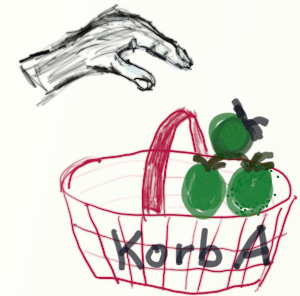
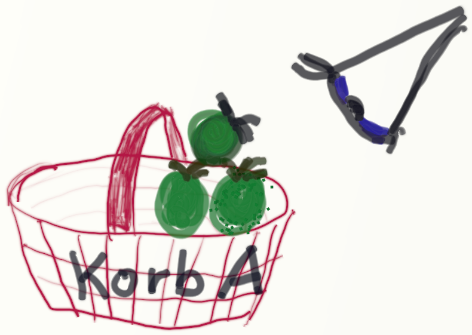

# Wiederholung / Auffrischen 


## Platzhalter / Variablen 

Da Variablen sozusagen der Grundpfeiler beim Programmieren sind, schauen wir uns in dieser Rückblende __nochmal__ genau die Verwendung von Variablen und Ihren Einsatz in einfachen mathematischen Aufgaben an:
 
Platzhalter / Variablen dienen - wie der Name andeutet - dazu, veränderliche Werte aufzunehmen. 
Man will aber den Variablen nicht nur Werte "reingeben", sondern man will dann auch die Variablen wieder "fragen" : Was für einen Wert hast Du denn?
In der Programmierung sagt man:

* der Variable wird ein Wert __zugewiesen__
* der Wert der Variablen wird __abgefragt__  


## Zuweisung an eine Variable

Vorstellen kann man sich das auch als Zuruf mit dem Megaphon:   
Hey Du, __Variable_A__, merk Dir doch bitte mal die __2__!

{height=60%}

## Zuweisung an eine Variable

Oder man stellt sich die Variable als Obstkorb vor, der mit Äpfeln "belegt" wird:

Korb_A :
{height=60%}

## Zuweisung an eine Variable

Belege den Korb_A mit 2:
{height=60%}

## Zuweisung an eine Variable

In einer "normalen" Programmiersprache : __Variable_A__ = 2  
Zuweisung an __Variable_A__, die Variable steht auf der linken Seite des Gleichheitszeichens, der Wert mit dem die Variable belegt werden soll, steht auf der rechten Seite des Gleichheitszeichens.


## Zuweisung an eine Variable

Die Zuweisung an eine Variable in unsere Calliope-Programmier-Sprache sieht so aus:

{height=60%}


## Abfrage/Benutzen einer Variable

So wie man sich vorher die Zuweisung mit einem Megaphon vorstellen kann, so kann man sich das Auslesen/Benutzen der Variable vorstellen, dass man mit einem altmodischen Hör-Rohr fragt:  
Hey Du, __Variable_A__, was war es, was Du Dir vorher merken solltest? Sag es mir doch bitte.

{height=60%}


## Abfrage/Benutzen einer Variable

Oder man stellt sich vor, wie man in den Obstkorb reinschaut, wieviele Äpfel denn dort drin sind, man __fragt__ die __Belegung ab__:

Was ist der Inhalt von Korb_A :
{height=60%}

## Abfrage/Benutzen einer Variable

So wie in unserem Korb-Beispiel der Korb nur angeschaut wird, ist das auch beim Programmieren: 

* Der Inhalt des Korbes ändert sich durchs Anschauen nicht
* Der Inhalt der Variable ändert sich durchs Auslesen, durch die Benutzung in einer Formel __nicht__.
 

In einer "normalen" Programmiersprache wird das üblicherweise z.B. so dargestellt:

* Variable_B = __Variable_A__ <br>Der Wert der Variable: __Variable_A__ wird erfragt, sie steht auf der rechten Seite des Gleichheitszeichens.

## Abfrage/Benutzen einer Variable

In unserer grafischen Calliope-Programmiersprache wird das Benutzen der Variable einfach durch das Puzzleteil mit der Variable dargestellt:

{height=60%}

## Abfrage/Benutzen einer Variable

Dieses eInzelne Puzzleteil kann man dann irgendwo anstatt festen Werten einklicken, also wenn man z.B. die Rechnung mit der __Variable_B__ von oben nochmals benutzen will:

* __Variable_B__ = __Variable_A__ <br>Der Wert der Variable: __Variable_A__ wird erfragt, sie steht auf der rechten Seite des Gleichheitszeichens.<br>Auf der linken Seite des Gleichheits-Zeichens wird das der Variable __Variable_B__ zugewiesen, <br>die __Variable_B__ wird mit dem selben Wert belegt.

 
 * {height=60%}


## Ein paar Rechnungen

Nun haben wir also mehrere Darstellungs-Möglichkeiten für Variablen-Belegung und Variablen-Abfrage gesehen:

* "Körbchen"-Darstellung
* Darstellung mit Text
* Grafische Calliope-Darstellung

Damit wollen wir noch ein paar ganz einfache Belegungen, Abfragen und Rechnungen zeigen.

## Korb A mit 2 belegen

__Korb_A = 2__

{height=60%}


{height=60%}

<hr>

### Korb B mit 1 belegen


__Korb_B = 1__

{height=60%}


{height=60%}

<hr>

### Korb C = Summe Korb A + B 


__Korb_C = Korb_A + Korb_B__

{height=60%}  {height=60%} {height=60%}  {height=60%}  {height=60%}


{height=60%}

<hr>

### Korb B erhöhen um 1


__Korb_B = Korb_B + 1__


{height=60%} {height=60%}  {height=60%} {height=60%} {height=60%}


{height=60%}

oder andere Möglichkeit, die auch leider einfach mit dem Setzen einer Variable zu verwechseln ist:

{height=60%}

<hr> 
 
### Was enthält nun Korb C? 

Vorher haben wir den Korb C mit der Summe von Korb A und Korb B belegt haben.  
Das Ergebnis war 3.
Nun haben wir den Korb B um eins erhöht.  
Ist nun der Wert des Korb C auch um 1 erhöht worden?  
__NEIN!__  
Die Berechnung wurde vorher ausgeführt.  
Das Ergebnis ändert sich nicht mehr.  
Der Korb C enthält immer noch die 3.  
Wir schauen nochmal nach :-)


{height=60%}  

<hr>

### Korb A erhöhen um 1

Ebenso können wir nun natürlich Korb A um eins erhöhen

__Korb_A = Korb_A + 1__


{height=60%} {height=60%}  {height=60%} {height=60%} {height=60%}


{height=60%}

oder andere Möglichkeit, die auch leider einfach mit dem Setzen einer Variable zu verwechseln ist:

{height=60%}

<hr> 

### Korb C = Summe Korb A + B 

Nun können wir nochmal die Berechnung von vorher durchführen: Korb C soll die Summe von Korb A und von Korb B enthalten.

In "normaler" Programmiersprache:  

__Korb_C = Korb_A + Korb_B__

* Korb A enthält 3 Äpfel
* Korb B enthält 2 Äpfel
* Korb C enthält vor der Berechnung schon 3 Äpfel
* Wenn wir nun die Berechnung durchführen, was enthält denn dann Korb C?
    * 5 Äpfel = 3 Äpfel von Korb A und 2 Äpfel von Korb B ? Oder etwa:
    * 8 Äpfel = 3 Äpfel von Korb A und 2 Äpfel von Korb B und die 3 eigenen Äpfel von vorher?
* ?
* ?
* ?
* Lösung: So wie wir die Berechnung formuliert haben: __Korb C = Korb A + Korb B__ ist der vorherige Inhalt von Korb C egal! Er wird quasi vorher ausgeleert! 
   
 Also sieht unsere Korb-Rechnung nun so aus: 
 

{height=60%}  {height=60%} {height=60%}  {height=60%}  {height=60%}

Und in Calliope-Rechnung sieht das ganz wieder genau gleich wie vorher aus:

{height=60%}

## Mathematik 

Ich denke mit der mathematischen Formel beim letzten Mal, das ging etwas zu schnell...

Darum hier nochmal ein paar Details dazu :

__Allerwichtigst__ : Die Formel selbst braucht Ihr nicht zu verstehen, es geht nur darum eine - für Euch unbekannte - Formel in Programm-Code umzusetzen.


Nochmal die Formel vom letzten Nachmittag:  
 
```Spannung in Millivolt = erhaltener Wert * 32 / 10```

Um das in zwei Schritten umsetzen zu können, benutzen wir einen Hilfswert, wir brechen die Berechnung auf:

```Hilfswert  = erhaltener Wert * 32```   <- Teil 1 der obigen Formel, vor dem "Geteilt durch"-Strich 
```Spannung in Millivolt = Hilfswert  / 10```    <- Teil 2 der obigen Formel , das Teilen durch 10

Diese mathematische Formel kann man nun recht einfach auch in zwei Schritten im Calliope umsetzen:


{height=60%}

Diese Berechnung sieht nun um einiges einfacher aus, als die Darstellung von der letzten Stunde:

{height=60%}


## Spannung / Verbraucher 

Hier nur die wichtigsten Dinge bezüglich Spannung / Verbraucher vom letzten Nachmittag:

* Die Steckdose ist __tabu__ ! 
* Unsere Spannungs-Bereiche liegen zwischen 1.5 Volt und ca 12 Volt, die Steckdose hat __220 Volt__
* Der Calliope arbeitet normalerweise mit 3.3 Volt
* Die Grösse einer Batterie sagt __NICHTS__ über ihre Spannung aus!
* Spannung von Lieferant (Batterie) und Verbraucher (z.B. LED etc) müssen übereinstimmen
* Bei Nichtübereinstimmung kann etwas kaputt gehen, wenn es dumm läuft ist das der Calliope
* Kurzschluss heisst der Pluspol und der Minus-Pol eines Spannungs-Lieferanten werden zusammengehalten/"kurzgeschlossen"
* Beim Kurzschluss geht üblicherweise etwas kaputt, wenn es dumm läuft, ist das der Calliope.


 
## Navigation


* [Hoch zur Übersicht](../README.md)  
* [Weiter](../04_02_Wenn-Dann/README.md)  


## Lizenz/Copyright-Info
Für alle Bilder auf dieser Seite gilt:

*  Autor: Jörg Künstner
* Lizenz: CC BY-SA 4.0

