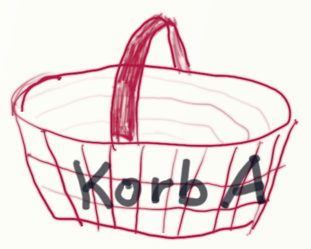
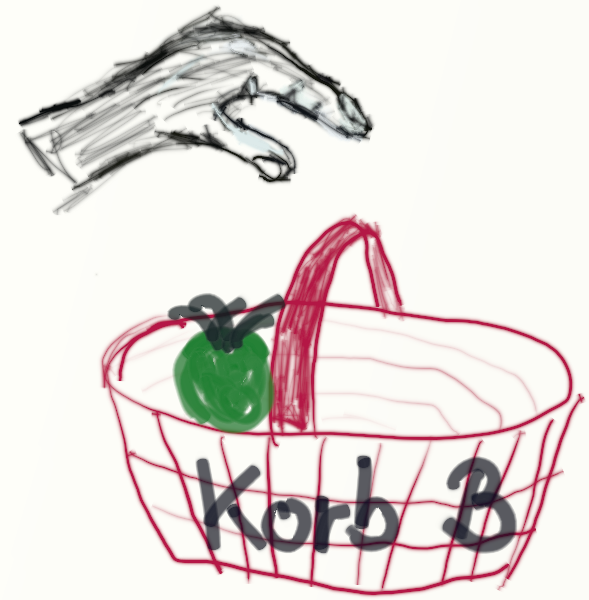
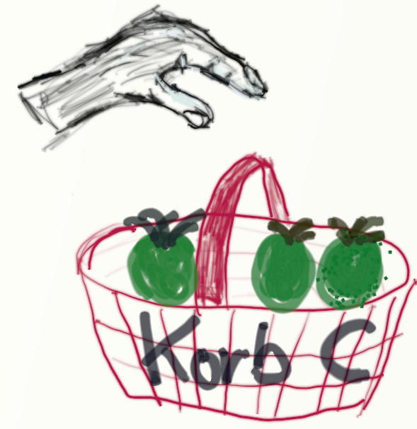

# Wiederholung / Auffrischen Variablen

## Platzhalter / Variablen 

Da Variablen sozusagen der Grundpfeiler beim Programmieren sind, schauen wir uns in dieser Rückblende __nochmal__ genau die Verwendung von Variablen und Ihren Einsatz in einfachen mathematischen Aufgaben an:
 
Platzhalter / Variablen dienen - wie der Name andeutet - dazu, veränderliche Werte aufzunehmen. 
Man will aber den Variablen nicht nur Werte "reingeben", sondern man will dann auch die Variablen wieder "fragen" : Was für einen Wert hast Du denn?
In der Programmierung sagt man:

* der Variable wird ein Wert __zugewiesen__
* der Wert der Variablen wird __abgefragt__  

## Zuweisung an eine Variable

Vorstellen kann man sich das auch als Zuruf mit dem Megaphon:   
Hey Du, __Variable_A__, merk Dir doch bitte mal die __2__!

{height=60%}

## Zuweisung an eine Variable

Oder man stellt sich die Variable als Obstkorb vor, der mit Äpfeln "belegt" wird:

Korb_A :
{height=60%}

## Zuweisung an eine Variable

Belege den Korb_A mit 2:
{height=60%}

## Zuweisung an eine Variable

In einer "normalen" Programmiersprache : __Variable_A__ = 2  
Zuweisung an __Variable_A__, die Variable steht auf der linken Seite des Gleichheitszeichens, der Wert mit dem die Variable belegt werden soll, steht auf der rechten Seite des Gleichheitszeichens.

## Zuweisung an eine Variable

Die Zuweisung an eine Variable in unsere Calliope-Programmier-Sprache sieht so aus:

{height=10%}

## Abfrage/Benutzen einer Variable

So wie man sich vorher die Zuweisung mit einem Megaphon vorstellen kann, so kann man sich das Auslesen/Benutzen der Variable vorstellen, dass man mit einem altmodischen Hör-Rohr fragt:  
Hey Du, __Variable_A__, was war es, was Du Dir vorher merken solltest? Sag es mir doch bitte.

{height=60%}

## Abfrage/Benutzen einer Variable

Oder man stellt sich vor, wie man in den Obstkorb reinschaut, wieviele Äpfel denn dort drin sind, man __fragt__ die __Belegung ab__:

Was ist der Inhalt von Korb_A :
{height=60%}

## Abfrage/Benutzen einer Variable

So wie in unserem Korb-Beispiel der Korb nur angeschaut wird, ist das auch beim Programmieren: 

* Der Inhalt des Korbes ändert sich durchs Anschauen nicht
* Der Inhalt der Variable ändert sich durchs Auslesen, durch die Benutzung in einer Formel __nicht__.
 

In einer "normalen" Programmiersprache wird das üblicherweise z.B. so dargestellt:

* Variable_B = __Variable_A__ 
   
    * Der Wert der Variable: __Variable_A__ wird erfragt, sie steht auf der rechten Seite des Gleichheitszeichens.

## Abfrage/Benutzen einer Variable

In unserer grafischen Calliope-Programmiersprache wird das Benutzen der Variable einfach durch das Puzzleteil mit der Variable dargestellt:

{height=15%}

## Abfrage/Benutzen einer Variable

Dieses einzelne Puzzleteil kann man dann irgendwo anstatt festen Werten einklicken, also wenn man z.B. die Rechnung mit der __Variable_B__ von oben nochmals benutzen will:

* __Variable_B__ = __Variable_A__ 

    * Der Wert der Variable: __Variable_A__ wird erfragt, sie steht auf der rechten Seite des Gleichheitszeichens.
    * Auf der linken Seite des Gleichheits-Zeichens wird das der Variable __Variable_B__ zugewiesen, 
    * die __Variable_B__ wird mit dem selben Wert belegt.

 
* {height=10%}

## Ein paar Rechnungen

Nun haben wir also mehrere Darstellungs-Möglichkeiten für Variablen-Belegung und Variablen-Abfrage gesehen:

* "Körbchen"-Darstellung
* Darstellung mit Text
* Grafische Calliope-Darstellung

Damit wollen wir noch ein paar ganz einfache Belegungen, Abfragen und Rechnungen zeigen.

## Korb A mit 2 belegen

__Korb_A = 2__

{height=50%}

{height=10%}

## Korb B mit 1 belegen

__Korb_B = 1__

{height=50%}

{height=10%}

## Korb C = Summe Korb A + B 

__Korb_C = Korb_A + Korb_B__

{height=60%}

## Korb C = Summe Korb A + B 

{height=25%}  
{height=5%}  
{height=25%}  
{height=5%}  
{height=25%}

## Korb B erhöhen um 1

{height=25%}  
{height=5%}  
{height=25%}  
{height=5%}  
{height=15%}

## Korb B erhöhen um 1

__Korb_B = Korb_B + 1__

{height=40%}

oder andere Möglichkeit, die auch leider einfach mit dem Setzen einer Variable zu verwechseln ist:

{height=20%}

 
## Was enthält nun Korb C? 

Vorher haben wir den Korb C mit der Summe von Korb A und Korb B belegt haben.  
Das Ergebnis war 3.
Nun haben wir den Korb B um eins erhöht.  
Ist nun der Wert des Korb C auch um 1 erhöht worden?  
__NEIN!__  
Die Berechnung wurde vorher ausgeführt.  
Das Ergebnis ändert sich nicht mehr.  
Der Korb C enthält immer noch die 3.  
Wir schauen nochmal nach :-) {height=20%}  

## Korb A erhöhen um 1

Ebenso können wir nun natürlich Korb A um eins erhöhen

__Korb_A = Korb_A + 1__

{height=40%}

oder andere Möglichkeit, die auch leider einfach mit dem Setzen einer Variable zu verwechseln ist:

{height=20%}

## Korb A erhöhen um 1

{height=25%}   
{height=5%}   
{height=25%}  
{height=5%}  
{height=15%}  

## Korb C = Summe Korb A + B 

Nun können wir nochmal die Berechnung von vorher durchführen: Korb C soll die Summe von Korb A und von Korb B enthalten.

In "normaler" Programmiersprache:  

__Korb_C = Korb_A + Korb_B__

* Korb A enthält 3 Äpfel
* Korb B enthält 2 Äpfel
* Korb C enthält vor der Berechnung schon 3 Äpfel
* Wenn wir nun die Berechnung durchführen, was enthält denn dann Korb C?
    * __5 Äpfel__ = 3 Äpfel von Korb A und 2 Äpfel von Korb B ? Oder etwa:
    * __8 Äpfel__ = 3 Äpfel von Korb A und 2 Äpfel von Korb B und die 3 eigenen Äpfel von vorher?
* ?
* ?
* ?

## Antwort : Korb C = Summe Korb A + B 

Lösung: So wie wir die Berechnung formuliert haben: 

__Korb C = Korb A + Korb B__  

ist der vorherige Inhalt von Korb C egal! Er wird quasi vorher ausgeleert! 
   
Also sieht unsere Korb-Rechnung nun so aus: 

## Antwort : Korb C = Summe Korb A + B 
 
{height=25%}  
{height=5%}  
{height=25%}  
{height=5%}  
{height=25%}

## Antwort : Korb C = Summe Korb A + B 

Und in Calliope-Rechnung sieht das ganz wieder genau gleich wie vorher aus:

{height=40%}

