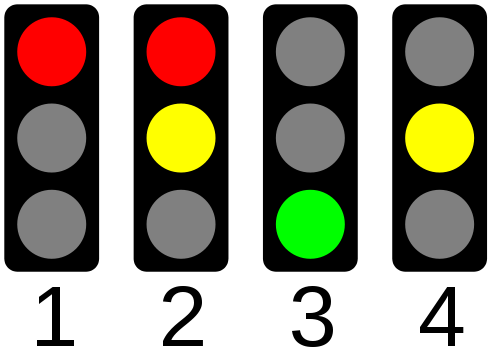
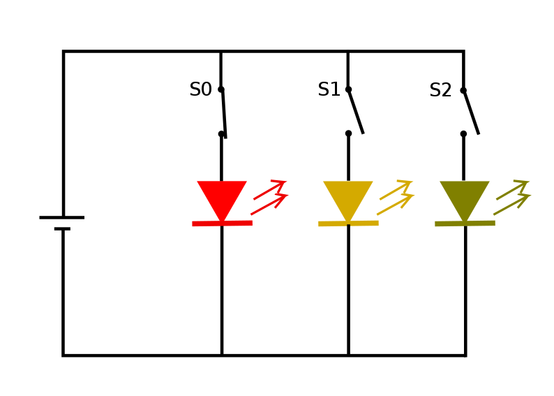

# Wiederholung / Auffrischen Ampel

## Spannung / Verbraucher 1

Hier nur die wichtigsten Dinge bezüglich Spannung / Verbraucher vom letzten Nachmittag:

* Die Steckdose ist __tabu__ ! 
* Unsere Spannungs-Bereiche liegen zwischen 1.5 Volt und ca 12 Volt, die Steckdose hat __220 Volt__
* Der Calliope arbeitet normalerweise mit 3.3 Volt
* Die Grösse einer Batterie sagt __NICHTS__ über ihre Spannung aus!

## Spannung / Verbraucher 2

* Spannung von Lieferant (Batterie) und Verbraucher (z.B. LED etc) müssen übereinstimmen
* Bei Nichtübereinstimmung kann etwas kaputt gehen, wenn es dumm läuft ist das der Calliope
* Kurzschluss heisst der Pluspol und der Minus-Pol eines Spannungs-Lieferanten werden zusammengehalten/"kurzgeschlossen"
* Beim Kurzschluss geht üblicherweise etwas kaputt, wenn es dumm läuft, ist das der Calliope.

## Ampel

* Die Ampel und die Ansteuerung der Pins ging letztes Mal vielleicht ein kleines bisschen (zu?) schnell.
* Darum in diesem Auffrischen das Ganze nochmal Schritt für Schritt

Wir möchten gerne eine Ampel haben, die folgendes ermöglicht:

## Ohne Calliope 1

{height=80%}

Wir brauchen eine Batterie

## Ohne Calliope 2

{height=80%}

Wir brauchen eine rote LED

## Ohne Calliope 3

{height=80%}

Wir brauchen eine gelbe LED

## Ohne Calliope 4

{height=80%}

Wir brauchen eine grüne LED

## Ohne Calliope 5

{height=80%}

Wir trennen Grün auf

## Ohne Calliope 6

{height=80%}

Wir trennen Gelb auf

## Ohne Calliope 7

{height=80%}

Wir trennen Rot auf

## Ohne Calliope 8

{height=80%}

Wir bauen Schalter ein (S0 - S2)

## Ohne Calliope 9

{height=80%}

Schalter S0 einschalten : Rot 

## Ohne Calliope 10

{height=80%}

Schalter S1 einschalten : Gelb

## Ohne Calliope 11

{height=80%}

Schalter S2 einschalten : Grün

