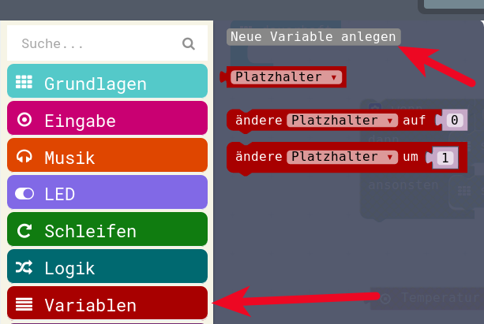
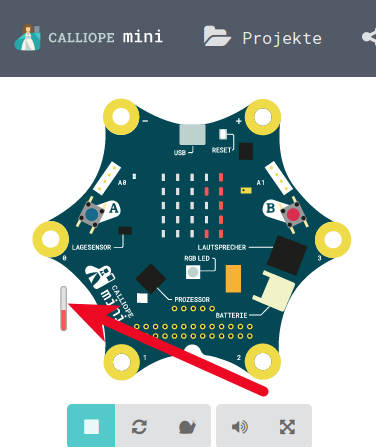

# Der Temperatur-Messer


## Sensor/Eingang/Input


Neben vielen anderen Sensoren/Eingängen, ein paar davon haben wir schon kennengelernt, hat der Calliope auch einen Temperatur-Sensor.

Diesen wollen wir nun als sinnvollen Eingangs-Wert für unsere Wenn-Dann Abfrage benutzen.

Davor wollen wir aber den Sensor selbst kurz kennenlernen, sehen wie man den abfrägt und was er für Werte liefert.

Dazu räumen wir unsere Dauerschlefe frei:

## Freiräumen der Dauerhaft-Schleife

Herausziehen der bisherigen __Wenn-Dann__ -Programmierung zur Seite.
**NICHT** löschen, wir wollen das später noch benutzen 


{height=60%}


## Das Menu Eingabe

Das Menu Eingabe 

{height=50%}

enthält eine Spezial-Variable, eine Input-Variable, namenes __Temperatur__.
Um diese sinnvoll weiter zu verwenden, legen wir Menu __Variablen__ eine eigene Variable an, die wir zum Beispiel __AktuelleTemperatur__ nennen.


## Variable anlegen 

Nun legen wir uns wieder eine neue Variable namens __AktuelleTemperatur__  an.


{height=60%}

## Variable benennen 

{height=60%}


## Temperatur auslesen 

Nun belegen wir also die neu angelegte Variable __AktuelleTemperatur__   mit der Temperatur, wie sie aus dem Eingabe-Menu kommt.


{height=60%}

## Temperatur anzeigen

und holen uns noch aus dem Grundlagen-Menu das __zeige Nummer__ und zeigen damit die Variable an, die die aktuelle Temperatur beinhaltet.


{height=60%}


## Temperatur im Simulator

Nun schauen wir uns das im Simulator an:

{height=60%}

Mit der Maus kann man an diesem Thermometer die Temperatur verändern.

## Temperatur im Simulator


Die Ausgabe kann noch etwas verbessert werden:

* die Zahlen "rauschen" nur durch und man weiss nicht ob das nun 21 oder 12 sind
* Man sieht nicht, dass es sich um eine Temperatur in Grad Celcius (°C) handelt.

## Verbesserung der Anzeige

Mit einem vereinfachten "__°C__" als Symbol und ein paar Delays und Bildschirmlöschen (das ist alles im Menu Grundlagen, zum Teil in "...Mehr" ) gibt die Anzeige dann schon was her.


{height=60%}


## Download in der Calliope

Jetzt ist der Programm-Code eigentlich gut genug, um eine echte Messung in unserem echten Calliope durchzuführen.

Wir laden das Programm dazu auf den Calliope:

* Dem Ganzen unten einen sinnvollen Namen geben (z.B. Temperatur-Messer_01 )
* Den Speichern-Knopf (Diskette ) drücken
* Das erzeigte und geladene HEX-File im __Download__ - Ordner finden
* Das HEX-File kopieren , "STRG-C"
* Den Calliope-Mini anschliessen
* Das HEX-File auf dem Calliope "fallen lassen", "Einfügen", "STRG-V" 
* Der Calliope sollte anfangen das neue Programm in seinen Speicher zu übertragen.


## JavaScript-Code

<details>
 <summary>Java-Script-Code</summary>

```js
let AktuelleTemperatur = 0
basic.forever(() => {
    AktuelleTemperatur = input.temperature()
    basic.showNumber(AktuelleTemperatur)
    basic.pause(500)
    basic.showLeds(`
        # . . # #
        . . # . .
        . . # . .
        . . # . .
        . . . # #
        `)
    basic.pause(500)
    basic.clearScreen()
    basic.pause(500)
})

```
</details>

__Download Hex-Code__

[Hex-code](code/mini-TemperaturMesser01.hex)


## Navigation


* [Zurück](../04_02_Wenn-Dann/README.md)  
* [Hoch zur Übersicht](../README.md)  
* [Weiter](../04_04_TemperaturAmpel/README.md)  


## Lizenz/Copyright-Info
Für alle Bilder auf dieser Seite gilt:

*  Autor: Jörg Künstner
* Lizenz: CC BY-SA 4.0

