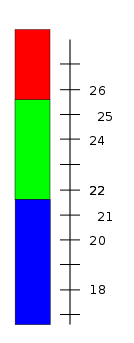
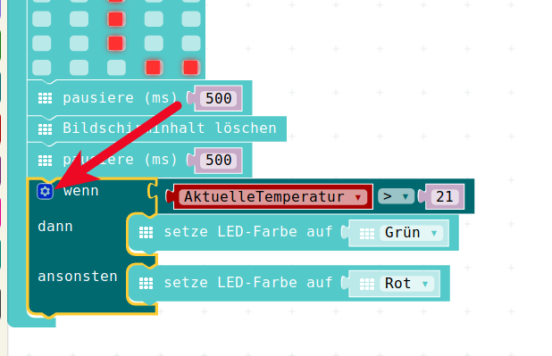
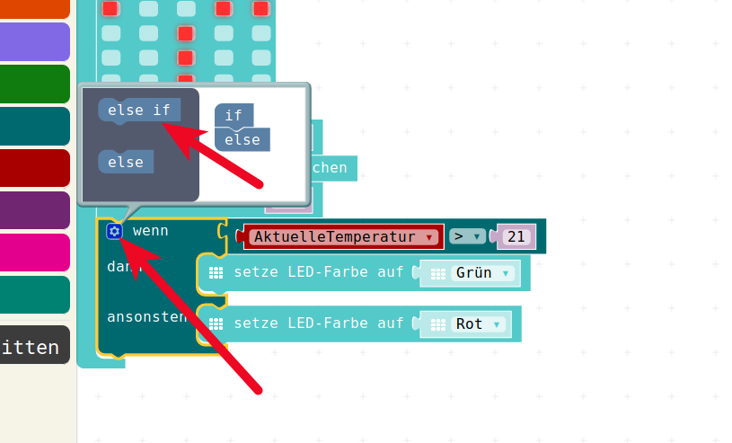
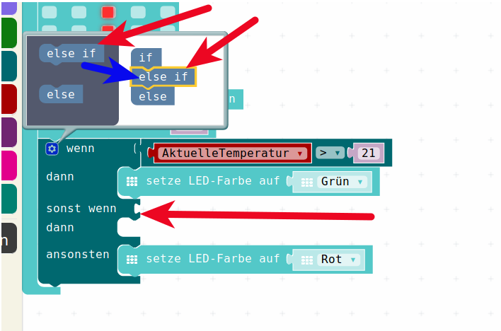
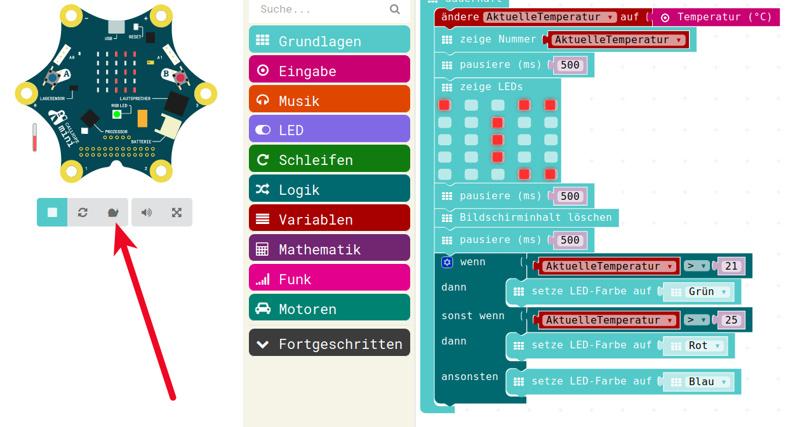
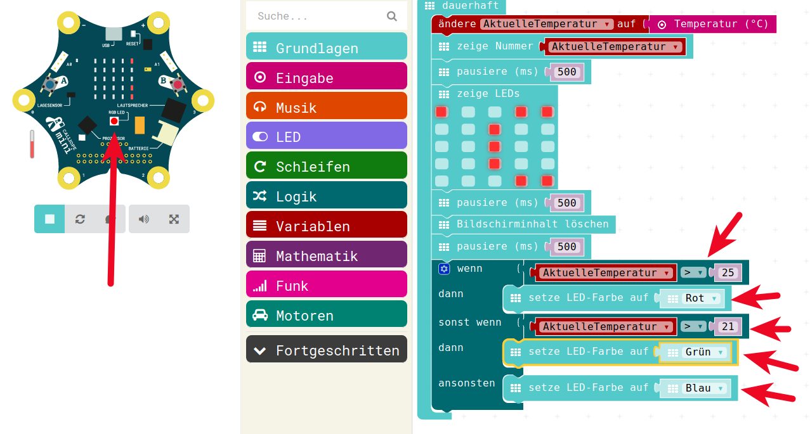

# Die verbesserte Temperatur-Ampel


## Echter grüner Bereich


Nun wollen wir die Temperatur-Ampel etwas verbessern.

* Wir legen einen grünen Bereich zwischen grösser 21 °C und 25 °C fest
* Wenn die Temperatur kleiner/gleich 21 °C ist, soll das Licht blau sein, es ist uns zu kalt (blau wie am Wasserhahn)
* Wenn die Temperatur in unserem "grünen" Bereich ist, dass soll natürlich auch die LED grün leuchten
* Wenn die Temperatur  grösser als 25 °C ist, dann soll die LED rot leuchten (rot wie am Wasserhahn)





## Wenn-Dann erweitert

Ebenso wie im "echten Leben" kann man auch das Wenn-Dann - Programmier-Konstrukt erweitern.

 __Wenn__ xyz __Dann__ macheDas 
 __Ansonsten Wenn__ abc __Dann__ macheJenes
 __Ansonsten Wenn__ def __Dann__ machedochnochwasanderes
 __Ansonsten__ MacheEinfachIrgendwas 


Mit solch einem Konstrukt können wir nun unserer Temperatur-Abfrage erweitern um eine zusätzliche Abfrage grösser 25° C  
Und die Farben müssen wir natürlich auch noch anpassen.


## Erweiterung in der Programmier-Oberfläche

Um das Wenn-Dann - Konstrukt in der Programmier-Oberfläche zu erweitern, muss im "Wenn-Dann-Puzzle-Stück" das Zahnrädchen benutzt werden.  
Das öffnet die Tool (= Werkzeug)-Box des Wenn-Dann-Puzzleteils.

 


Leider merkt man bei diesen Spezialitäten, dass die Programmier-Oberfläche noch nicht an allen Stellen vom Englischen ins Deutsche übersetzt wurde, dann hier kommen plötzlich:

* __if__ anstatt __wenn__
* __else if__ anstatt __sonst wenn__ 
* __else__ anstatt __sonst__
  



Die Benutzung ist hier auch etwas gewöhnungs-bedürftig:  
Um unser "Wenn-Dann"-Konstrukt um ein zusätzliches __sonst wenn__ zu erweitern zieht man das __else if__ oben in der Toolbox von der linken Hälfte auf die rechte Hälfte rüber, zwischen das __if__ und das __else__.  
Dies führt unten zu Erweiterung der Wenn-Dann-Abfrage um eine __Ansonsten Wenn__ - Konstruktion.

Mann kann auch durchaus noch mehrere dieser __else if__ einbauen, wenn man noch mehr Fälle unterscheiden will.

Für unsere Zwecke reicht allerdings dieses eine.




## Einbau der zusätzlichen Abfragen

Nun können wir also in die zusätzlichen Abfragen unsere weiteren Überprüfungen auf Temperatur > 25 einklicken (am Besten die Überprüfung per rechter Maustaste von oben kopieren) und die LED-Farben-Setzen befehle einklicken und die Farben entsprechend ändern.


Nun können wir das zuerst im Simualtor ausprobieren, indem wir die Temperatur ändern und die Farbe der LED beobachten.


## Ein Bug ( ein Fehler) !

Es geht nicht!  
Wir bekommen kein __rot__ zu sehen!  
Was ist falsch?  

Dazu können wir mal versuchen, die Temperatur auf  > 26°C, also z.B. 30°C  einzustellen und dann das Programm anschauen / beobachten.

Dazu eignet sich die __Schnecke__.   
Die lässt das Programm im Simulator im Schneckentempo ablaufen und zeigt jeweils durch hervorheben an, welcher Schritt gerade ausrchgeführt wird.
 


Das ist schonmal eine grosse Hilfe und könnte uns bei der Fehlersuche unter die Arme greifen.

Was passiert?  
Auch eine Temperatur von z.B. 30°C, di ja als rot angezeigt werden soll, geht durch das ganze Wenn-Dann-Konstrukt durch, wenn irgendeine Bedingung erfüllt ist, dann wird die zugehörige Aktion durchgeführt und dann das Konstrukt verlassen.

* Als erstes wird die gemessene aktuelle Temperatur von 30°C überprüft, ob sie grösser ist als 21 °C.
* 30°C __IST__ grösser als 21°C
* Der Vergleich liefert das Ergebnis __WAHR__
* Also wird die zueghörige Aktion durchgeführt: Setzen der Farbe auf grün 
* Das __Sonst Wenn__ wird gar nicht erreicht und darum dann auch die Überprüfung auf > 25°C erst gar nicht durchgeführt!


## Umbau des Wenn-Dann-Konstrukts

Nachdem wir diesen Fehler gefunden haben, müssen wir unser __"Wenn-Dann"__ - Konstrukt umbauen:

* als erstes Vergleich auf > 25 °C  => ROT
* als zweites Vergleich auf > 21 °C  => GRÜN
* ansonsten => BLAU

Vor dem Umbau spielen wir das hier einmal durch :  

gemessener Wert : __30__  

* als erstes Vergleich auf > 25 °C : __WAHR__  => ROT und Ende
* Ergebnis : __ROT__

gemessener Wert : __24__  
* als erstes Vergleich auf > 25 °C : __FALSCH__ => Weiter
* als zweites Vergleich auf > 21 °C : __WAHR__ => GRÜN und Ende
* Ergebnis : __GRÜN__

gemessener Wert : __19__  
* als erstes Vergleich auf > 25 °C : __FALSCH__ => Weiter
* als zweites Vergleich auf > 21 °C : __FALSCH__ => Weiter
* ansonsten => BLAU
* Ergebnis : __BLAU__


Nun ziehen wir also unsere Vergleichs-Puzzle-Teile und unsere RGB-LED-Farben-Setz-Puzzle-Teile raus:


und setzen es wie angedacht wieder zusammen.


 
 Wenn wir nun die Temperatur mit der Maus im Simulator ändern, dann sehen wir, dass die Farb-Anzeige unsere LED wir gewünscht funktioniert.
  

## Download in der Calliope

Jetzt ist der Programm-Code eigentlich gut genug, um eine echte Messung in unserem echten Calliope durchzuführen.

Wir laden das Programm dazu auf den Calliope


## JavaScript-Code

<details>
 <summary>Java-Script-Code</summary>

```js
let AktuelleTemperatur = 0
basic.forever(() => {
    AktuelleTemperatur = input.temperature()
    basic.showNumber(AktuelleTemperatur)
    basic.pause(500)
    basic.showLeds(`
        # . . # #
        . . # . .
        . . # . .
        . . # . .
        . . . # #
        `)
    basic.pause(500)
    basic.clearScreen()
    basic.pause(500)
    if (AktuelleTemperatur > 25) {
        basic.setLedColor(Colors.Red)
    } else if (AktuelleTemperatur > 21) {
        basic.setLedColor(Colors.Red)
    } else {
        basic.setLedColor(Colors.Blue)
    }
})

```
</details>

## Download Hex-Code

[Hex-code](code/mini-TemperaturMesser03.hex)


## Navigation


* [Zurück](../04_04_TemperaturAmpel/README.md)  
* [Hoch zur Übersicht](../README.md)  


## Lizenz/Copyright-Info
Für alle Bilder auf dieser Seite gilt:

*  Autor: Jörg Künstner
* Lizenz: CC BY-SA 4.0
