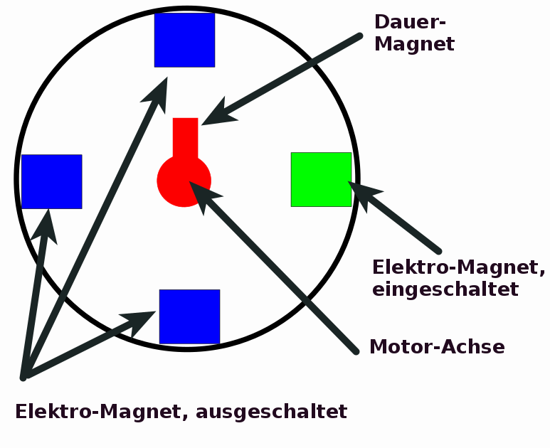
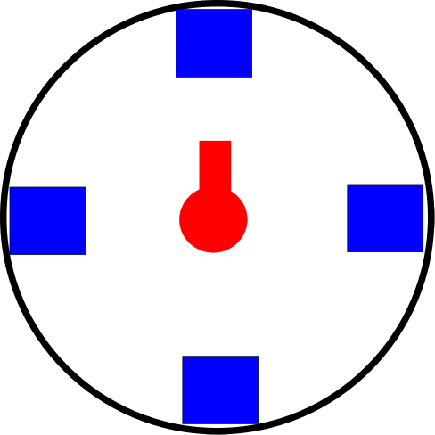
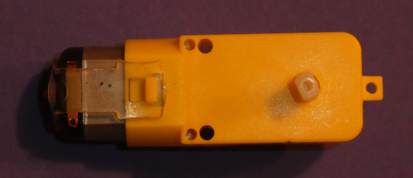
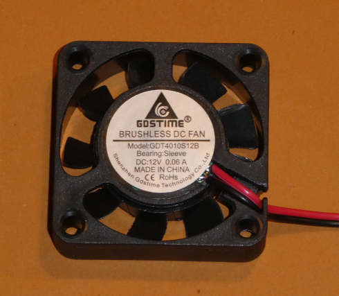
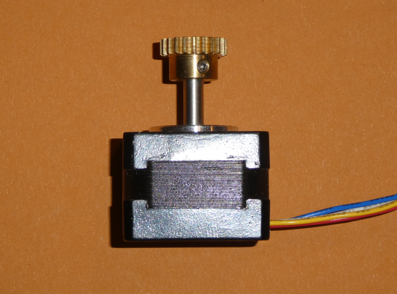

# Elektro-Motoren

## Verschiedene Motoren

Es gibt sehr viele verschiedene Motoren:

- Dieselmotoren
- Benzin-Motoren
- Düsen-Antriebs-Motoren
- ...

Um die alle wollen wir uns heute sicher __NICHT__ kümmern...

## Elektro Motoren

Sondern heute wollen wir - wie oben geschrieben - Elektro-Motoren anschauen.
Aber auch bei den Elektro-Motoren gibt es sehr grosse Unterschiede,
sowohl was deren elektrische Spannung als auch was deren Funktionsweise anbelangt.

## Elektro Motoren

Folgende Arten von Elektro-Motoren fallen mir auf Anhieb ein:

* DC-Motoren
* Schritt-Motoren
* Servo-Motoren
* DC-Motoren mit Getriebe
* und noch mehr
* ...

## Grundprinzip

Grundprinzip ist im Allgemeinen immer ein Elektro-Magnet, 
der einen Permanent-Magneten anzieht 
und in dem Moment, wenn der Permanent-Magnet "angekommen" ist, 
wird der Elektro-Magnet ausgeschaltet 
und dann der nächste Elektro-Magnet ein Stück weiter in der Drehung eingeschaltet.

(Achtung: Das ist nur das Prinzip. Im Detail sieht das meist etwas anders aus, aber so kann man es sich am ehesten bildlich vortsellen)

## Grundprinzip

So kann man sich das vorstellen:

{height=60%}

## Grundprinzip

* Der eingeschaltete Elektro-Magnet zieht den Dauer-Magneten an
* Der Dauer-Magnet bewegt sich in Richtung Elektro-Magnet
* Die Achse dreht sich mit
* Wenn der Dauer-Magnet den Elektro-Magnet erreicht hat, schaltet sich der Elektro-Magnet ab
* Der Elektro-Magnet eine viertels Umdrehung weiter schaltet sich ein
* Er zieht den Dauer-Magneten an
* usw. ... usw. 

## Animierter Motor Langsam

{height=80%}

## Animierter Motor Schnell

Und wenn das ganze etwas schneller abläuft, dann sieht das so aus:

{height=80%}

## Realistischere Animation 

Wie geschrieben, das zeigt nur das Prinzip.   
Dieses Model kommt der Wirklichkeit näher:
{height=60%}

\begin{tiny}
( https://de.wikipedia.org/wiki/Elektromotor  , MichaelFrey, CC BY-SA 3.0 )
\end{tiny}

## DC-Motoren

__DC-Motoren__ benutzen dieses Prinzip um einen Motor einfach ständig komplett um seine Achse drehen zu lassen. 
Dabei wird durch einen sehr einfachen Mechanismus dafür gesorgt, dass die jeweiligen Magneten ständig weiter-geschaltet werden.
Im Allgemeinen kann man (im Bereich wie es für diesen Motor festgelegt ist) sagen:
Höhere Spannung => Schnellere Drehung.
Wie weit sich der Motor dreht, kann normalerweise nicht haargenau vorherbestimmt werden.

## Robotik-Motor

Das hier ist ein "Standard"-Robotik-Motor mit eingebautem Getriebe, der Motor selbst ist ein DC-Motor.

{height=40%}

{height=40%}

## Lüfter-Motor
Das hier ist ein Lüfter-Motor, wie er im Computerbau verwendet wird, auch das ist ein normaler DC-Motor.

{height=60%}

## Schritt-Motoren

Bei __Schritt-Motoren__ hat man das normalerweise selbst haargenau im Griff, man kann entweder durch Elektronik oder durch genaue Programmierung genau einzelne Schritte bestimmen.
Da wird zum Beispiel ein Schritt-Motor mit 36 Schritten pro Umdrehung hergestellt, d.h. jeder Schritt dreht den Motor um 10° weiter und nach 36 Schritten hat er genau eine komplette Umdrehung gemacht.
Die einzelnen Schritte müssen gesteuert werden.

## Schritt-Motoren

Das hier ist ein Schritt-Motor, er hat vier Anschlüsse:

{height=60%}

Wenn man den Schritt-Motor von Hand dreht, kann man die einzelnen Schritte auch spüren.

## Servo-Motoren

__Servo-Motoren__ hingegen haben eine ganz andere Funktion:  
Sie können sich normalerweise nur ca eine halbe Umdrehung umdrehen. Sie werden üblicherweise mit Gradzahlen angesteuert.  
So kann man einen Servomotor von 0 - 180 Grad ( Eine volle Umdreheung sind immer 360 Grad) ansteuern, normalerweise ist die Null-Stellung bei 90 Grad, man kann also einen Servomotor um eine viertels Drehung nach links auf 0 und um eine viertels Drehung nach rechts auf 180 Grad bewegen.  
Im Modellbau werden Servos sehr oft benutzt, z.B. um zu lenken, um ein Höhenruder beim Flugzeug zu verstellen.  
Unser Calliope-Männchen hier in der Turbine nutzt einen Servo-Motor um zu winken.

## Servo-Motoren

Das hier ist ein Servo-Motor, er hat drei Anschlüsse, 

{height=60%}

* einmal Plus, 
* einmal Minus 
* und einmal den Ansteuer-Anschluss

## Was wir uns anschauen

Wir schauen uns heute und beim nächsten Mal die Ansteuerung von von Servos und von normalen DC-Motoren (mit Getriebe) an.

## Navigation

* [Zurück](../06_02_Schleifen/index.html)  
* [Hoch zur Übersicht](../index.html)  
* [Weiter](../06_04_Servos/index.html)  

## Lizenz/Copyright-Info
Für alle Texte und Bilder auf diesen Folien gilt, soweit nicht anders unter dem Bild gekennzeichnet:

* Autor: Jörg Künstner
* Lizenz: CC BY-SA 4.0

