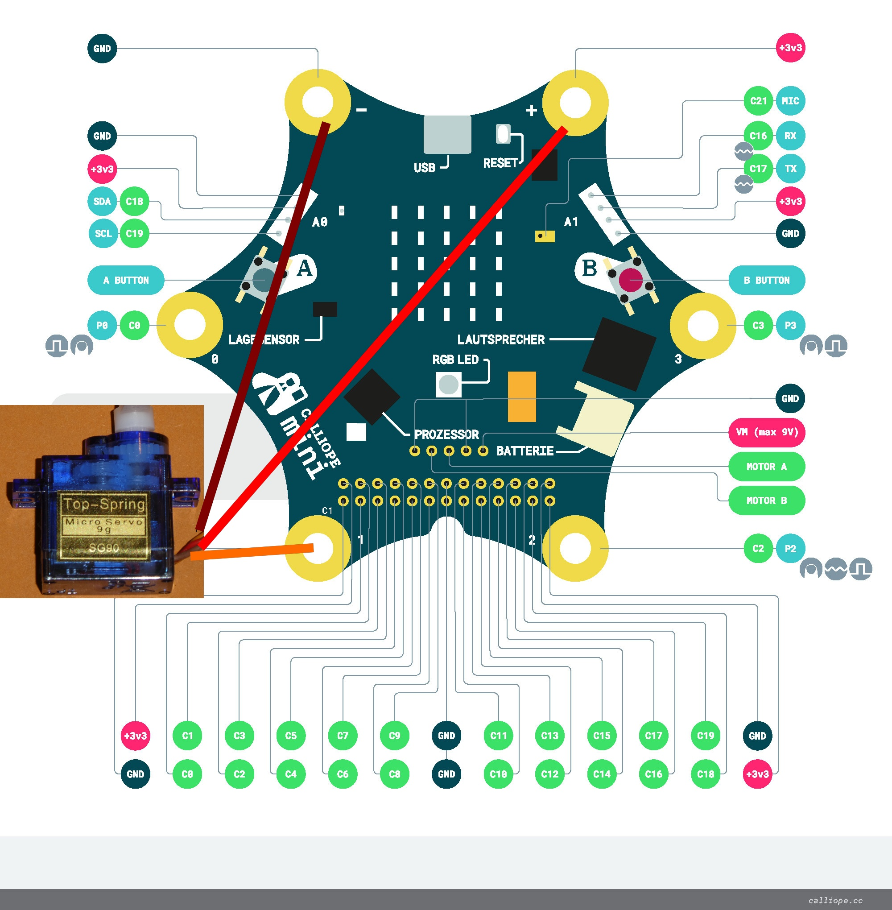
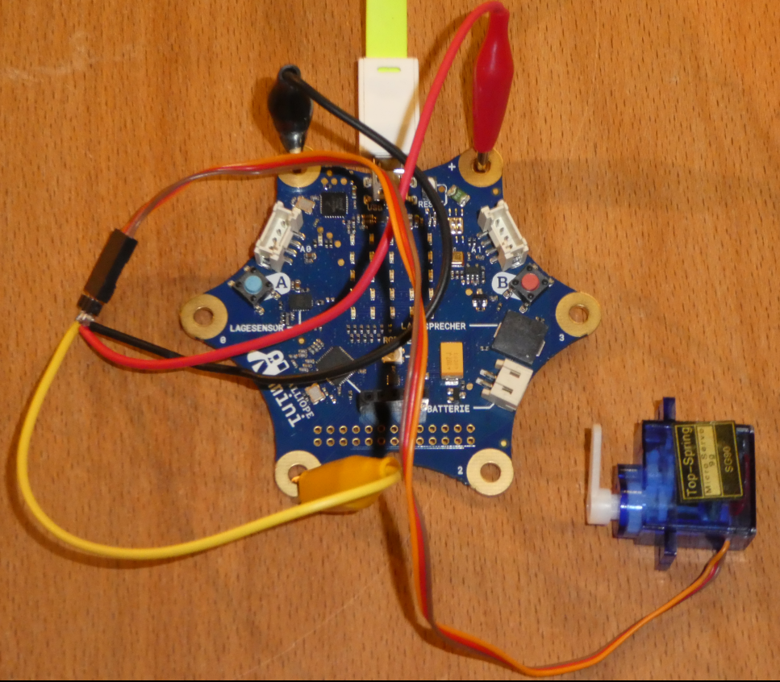
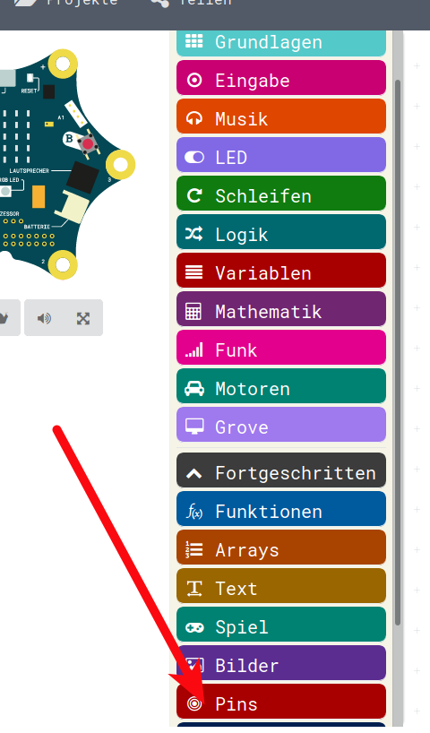
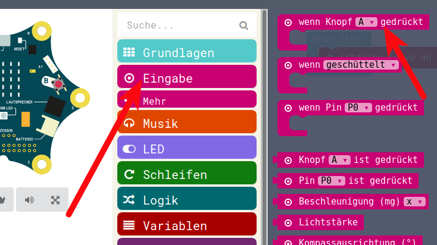
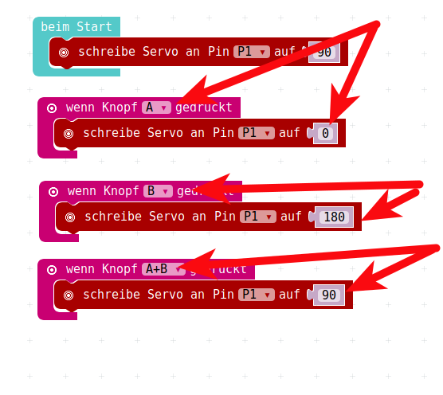
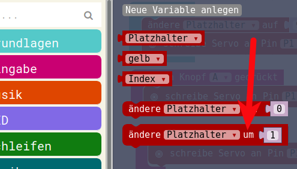

# Servo-Motoren

## Nochmals: Servo-Motor

__Servo-Motoren__  haben eine ganz andere Funktion:  
Sie können sich normalerweise nur ca eine halbe Umdrehung umdrehen. Sie werden üblicherweise mit Gradzahlen angesteuert.  
So kann man einen Servomotor von 0 - 180 Grad ( Eine volle Umdreheung sind immer 360 Grad) ansteuern, normalerweise ist die Null-Stellung bei 90 Grad, man kann also einen Servomotor um eine viertels Drehung nach links auf 0 und um eine viertels Drehung nach rechts auf 180 Grad bewegen.  
Im Modellbau werden Servos sehr oft benutzt, z.B. um zu lenken, um ein Höhenruder beim Flugzeug zu verstellen.  


## Servo-Motoren-Anschluss

Da Servo-Motoren eine andere Funktionalität als normale Motoren haben, werden sie auch anders angeschlossen.

Ein Servo-Motor hat 3 Anschlüsse:

* Plus
* Minus
* Steuerung

Plus und Minus können wir "ganz normal" von den oberen beiden Anschlüssen mit "+" und "-" holen, für den Steuerungs-Pin können wir den Pin 1 nehmen.

Prinzip-Bild :



Das heisst vom Calliope zum Servo:

* Minus, oben links, wird dann zu Braun am Servo
* Plus, oben rechts, wird dann zu Rot am Servo
* Steuerung, unten links, bei der __1__, wird dann zu Orange am Servo 

Unser Anschluss sieht nun also so aus:



## Servo-Funktion

Servos können - wie vorher geschrieben - üblicherweise um 180 Grad gedreht werden, 90 Grad ist die Mittenstellung, 0 Grad ist ganz nach links ausschlagen und 180 Grad ist ganz nach rechts ausschlagen.

Ohne Strom sind Servos normalerweise in der Mittenstellung.

## Servo-Motoren Ansteuerung

Die Ansteuerung von Servo-Motoren befindet sich __NICHT__ im Menu Motoren sondern im Menu __Pins__.  
Dieses widerum befindet sich weiter unten, bei __Fortgeschritten__


Hier befindet sich das Menu Pins:




Im Menu Pins wiederum befindet sich das, was wir brauchen:  
Ansteuerung eines Servos an Pin 1 (oder auch , siehe Dreieck...) an Pin 0 -4


## Simples Servo-Programm

Nun können wir ein sehr sehr sehr einfaches Programm schreiben, welches beim Starten den Servo auf Mittenstellung bringt.  
Da die meisten Servos OHNE Spannung und Ansteuerung auf der Mittenstellung - also 90 Grad - sind, ist das nicht sehr spannend.  
Darum solltet Ihr bei Eurem ersten Programm lieber auf 0 Grad oder 180 Grad einschalten, dann seht Ihr eine kurze Bewegung.


Dieses Programm bitte auf den Calliope runterladen, am Simulator geht das leider nicht.

__ACHTUNG__ : der Servo-Motor dreht sich bei diesem Programm ur ein einziges Mal in die Position, die Ihr eingetragen habt, danach __passiert nichts mehr!__

Je nach Servo könnt Ihr vielleicht noch ein Vibrieren spüren, das zeigt nur an, dass der Servo aktiv etwas tut, um den Servo in genau dieser Stellung zu halten, aber drehen tut sich der Servo-Motor nicht mehr, denn Ihr habt Ihm gesagt, er soll auf xxx Grad einstellen. Das macht er. 


## Nun mit Knopf-Druck

Nun wollen wir unseren Servo mitteles unseren Knöpfen ansteuern:

* Beim Start : Mittelstellung, 90 Grad
* Linker Knopf : Links-Stellung , 0 Grad
* Rechter Knopf : Recht-Stellung, 180 Grad
* Beide Knöpfe : Mittel-Stellung, 90 Grad

Dazu holen wir uns aus dem Menu __Eingabe__ dreimal eine Reaktion auf einen Knopf-Druck:




Dieses Programm-Gerüst füllen wir nun sinnvoll:



Auch dieses Programm bitte auf den Calliope runterladen, am Simulator geht das leider nicht.

### JavaScript-Code Servo 1

Versuch 1, einen Servo anzusteuern. 

<details>
 <summary>Java-Script-Code</summary>

```js


input.onButtonPressed(Button.A, () => {
    pins.servoWritePin(AnalogPin.P1, 0)
})
input.onButtonPressed(Button.B, () => {
    pins.servoWritePin(AnalogPin.P1, 180)
})
input.onButtonPressed(Button.AB, () => {
    pins.servoWritePin(AnalogPin.P1, 90)
})
pins.servoWritePin(AnalogPin.P1, 90)

```
</details>

### HEX-Code Servo 1


[Hex-code](code/mini-Servo_Motor_01.hex)


## Nun mit Zwischen-Schritten

Nun wollen wir anstatt ganz auf die Endposition zu fahren, den Servo in Schritten kontrollieren.

Dazu müssen wir eine Variable, die den aktuellen Servo-Stand repräsentiert , jeweils bei einem Knopfdruck erhöhen oder verringern und dann diesen Wert an den Servo schreiben.

* Beim Start : Mittelstellung, 90 Grad
* Linker Knopf : jedesmal 10 Grad abziehen 
* Rechter Knopf : jedesmal 10 Grad darauf addieren
* Beide Knöpfe : Mittel-Stellung, 90 Grad

Dazu müssen wir nun also Variablen verwenden, hier eignet sich wieder besonders der Befehl um Variablen zu verändern, nicht der um Variablen zu setzen!



Wenn wir das nun sinnvoll einsetzen dann kommen wir zu folgendem oder ähnlichem Programm:


Auch dieses Programm bitte auf den Calliope runterladen, am Simulator geht das leider nicht.


### JavaScript-Code Servo 2

Versuch 2, einen Servo anzusteuern. 

<details>
 <summary>Java-Script-Code</summary>

```js

let Platzhalter = 0
input.onButtonPressed(Button.A, () => {
    Platzhalter += -10
    pins.servoWritePin(AnalogPin.P1, Platzhalter)
})
input.onButtonPressed(Button.B, () => {
    Platzhalter += 10
    pins.servoWritePin(AnalogPin.P1, Platzhalter)
})
input.onButtonPressed(Button.AB, () => {
    Platzhalter = 90
    pins.servoWritePin(AnalogPin.P1, Platzhalter)
})
Platzhalter = 90
pins.servoWritePin(AnalogPin.P1, Platzhalter)

```
</details>

### HEX-Code Servo 2


[Hex-code](code/mini-Servo_Motor_02.hex)


## Navigation


* [Zurück](../06_03_Motoren/README.md)  
* [Hoch zur Übersicht](../README.md)  


## Lizenz/Copyright-Info
Für alle Bilder auf dieser Seite gilt:

*  Autor: Jörg Künstner
* Lizenz: CC BY-SA 4.0

