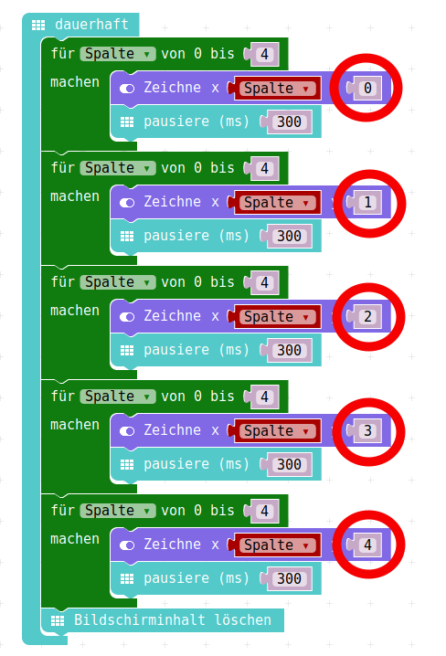

# Kurs Programmieren Lernen mit Calliope Mini
   
   
   
## Nachmittag  4, "Hausaufgaben"

### Schleifenprogrammierung 

Unser letztes Programm zur Schleifen-Programmierung hat so ausgesehen:

Wir haben hier 5 Schleifen, die jeweils Spaltenweise eine LED nach der anderen zeichne, die in Summe den Bildschirm also Zeile für Zeile füllen.

Wie wir am vierten Nachmittag gelernt haben, setzen wir Schleifen unter anderem dazu ein, um Wiederholungen zu vermeiden.

Nuun haben wir aber 5 mal eine Schleife die komplett identisch aussieht, bis auf dass der Y-Wert, die Zeile von 0 -4 durchgezählt wird.

Das müsste doch einfacher gehen?

Lösung: Eine Schleife in der Schleife...

Viel Erfolg!

### RGB-Led mit Schleife.

Die RGB-LED kann nicht nur die vorgefertigten Farben anzeigen, sondern sie kann die Farben beliebig mischen.

RGB steht für __R__ ot __G__ elb __B__ lau, mit diesen 3 Grundfarben kann man jede Farbe zusammenmischen.

Die Anteile von Rot Gelb und Blau lassen sich von 0 bis 255 verändern.

Da kann man eine Schleife nutzen und verschiedene Farben produzieren.

Spielt doch damit mal rum, im Menu findet sich das hier:

und damit kann man z.B. verschiedene Rot-Töne machen:

oder man kann damit von Blau über Lila nach Rot "faden"

Aufgabe: __Spielen__
