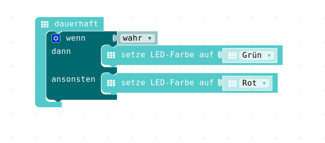
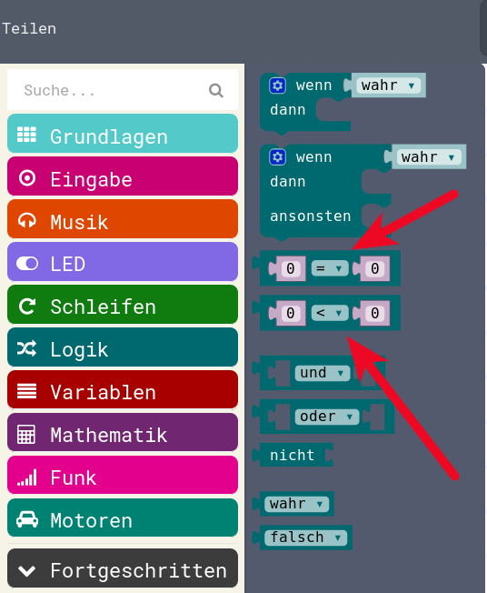
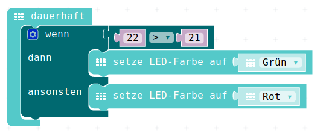
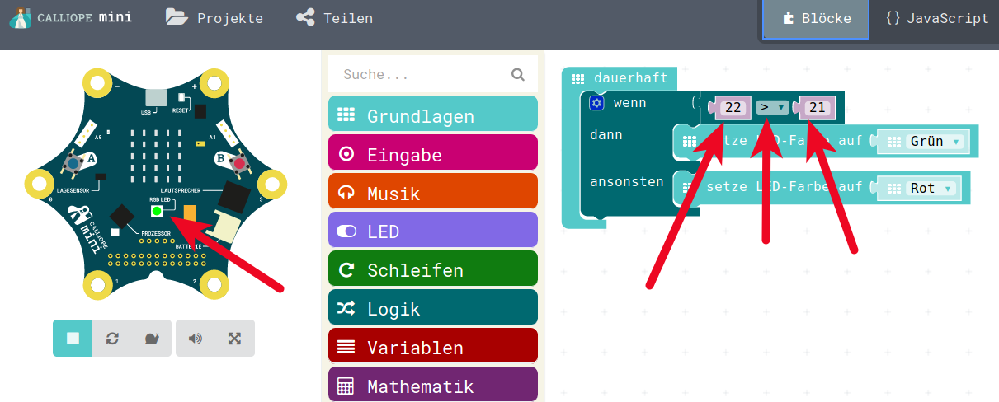

# Logik, Vergleiche, Wahrheit


## Weltmeisterschaft / Fussball-Wetten / Vergleiche


* Wer hat die Fussball-Weltmeisterschaft geschaut?   
* Wer hat dabei Wetten gemacht" ?  
* **Wenn** die Schweiz ein Tor mehr schiesst als Deutschland, 
* **dann** bekomme ich von Dir zwei zusätzliche Panini-Bilder?  

## Weltmeisterschaft / Fussball-Wetten / Vergleiche

* Wer streitet hin und wieder mit seinem Freund?  
* **Wenn** Du mir das Lego nicht gibst, 
* **dann** bekommst Du von mir keine Schokolade mehr.   

und so weiter...

## Weltmeisterschaft / Fussball-Wetten / Vergleiche

Das alles sind Vergleiche, die normalerweise dann im Anschluss überprüft werden können und sich entweder als wahr oder falsch erweisen.

Je nachdem, ob wahr oder falsch, wird dann etwas gemacht:

* Du bist nicht mehr mein Freund
* Du musst mir zwei Panini geben
* Ich muss Dir eine Schoki geben
* ...

## Weltmeisterschaft / Fussball-Wetten / Vergleiche

Das ist eines der wichtigen Eigenschaften auch beim Programmieren:

* Einen **Vergleich** machen, der ein Ergebnis hat, 
* dies ist im Allgemeinen **wahr** oder **falsch**
* Basierend auf dem __wahr__ oder __falsch__ 
* wird dann etwas unterschiedliches __gemacht__, 
* es wird eine __Aktion__ ausgelöst.

Das wollen wir jetzt auch machen


## Das Menu Logik

Das Menu Logik 

{height=60%}


## Das Menu Logik

enthält die Wenn-Dann Programmierung, es enthält die Vergleiche die wir machen wollen und es enthält auch "Wahr" und "Falsch" - Werte 

{height=60%}

## Wenn Dann in der Dauerschleife

Das Wenn-Dann ziehen wir in den Arbeitsbereich in die Dauer-Schleife


{height=60%}


## Symbole in der Wenn-Dann

Nun können wir mit zwei einfachen Symbolen auf unserem "Display" anzeigen, wie sich das Wenn-Dann verhaält

{height=50%}

## Wenn-Dann Ergebnis Wahr

In der Wenn-Dann-Abfrage kommt immer oben die __Aktion__, die gemacht werden soll, wenn die Aussage __wahr__ ist, darunter kommt das, was gemacht werden soll, wenn die Aussage sich als __falsch__ erweist.

{height=60%}

## Wenn-Dann Ergebnis Falsch

So sieht das Ganze aus, wenn die Aussage __Falsch__ ist.

{height=60%}

## Einsatz der farbigen RGB-Leucht-Diode

Wir haben ja auch eine farbige Leuchtdiode auf dem Calliope, die soll nun zum Einsatz kommen. 

Anstatt Symbole auf dem 5x5 - roten LED-Display wollen wir die LED in unterschiedlichen Farben leuchten lassen.

Die LED befindet sich auch unter Grundlagen (auch zu erkennen an der Farbe!)


{height=60%}

## Farbigen RGB-Leucht-Diode in Wenn-Dann


{height=40%}

## Farbigen RGB-Leucht-Diode leuchtet Grün

Da momentan der Wert __Wahr__ in die Abfrage reingeben wird, leuchtet unsere RGB-Led in Grün.

Jetzt ist übrigens ein guter Moment, um das nicht nur im Simulator auszuprobieren, sondern das Programm als HEX-Datei zu speichern und auf dem Calliope-Board auszuprobieren. 

{height=60%}


## Vergleiche 

Nun wollen wir aber __echte__ Vergleiche machen, dazu können wir zum Beispiel zwei Zahlen miteinander vergleichen und das Ergebnis auswerten:

* Zwei ist grösser als Fünf : __Falsch__
* Sechs ist grösser als Fünf : __Wahr__
* Sechs ist grösser als Sechs : __Falsch__
* Zehn ist kleiner als Sechs : __Falsch__
* Zehn ist gleich Zehn : __Wahr__
* Acht ist gleich Neun : __Falsch__


## Vergleiche 

Das kleiner-Zeichen habt Ihr in Mathematik wahrscheinlich auch noch nicht gehabt, aber es ist eigentlich __selbst__ sprechend:

* Kleinere Zahl < Grössere Zahl
* Grössere Zahl > Kleinere Zahl

Damit wird:

* Zwei ist grösser als Fünf : 2 > 5 :  __Falsch__
* Sechs ist grösser als Fünf : 6 > 5 : __Wahr__
* Sechs ist grösser als Sechs : 6 > 6 : __Falsch__
* Zehn ist kleiner als Sechs : 10 < 6 : __Falsch__
* Zehn ist gleich Zehn : 10 = 10 : __Wahr__
* Acht ist gleich Neun : 8 = 9 : __Falsch__


## Vergleiche 

{height=60%}

## Vergleich aus dem Menu holen

und anstelle von "__Wahr__" in die Wenn-Dann reinsetzen

Nun haben wir einen - __noch sinnlosen__ - Vergleich:


{height=50%}


## Vergleich auf > grösser setzen

Mit dem kleinen Dreieck beim Vergleich können wir nun denn kleiner-Vergleich auf einen Grösser-Vergleich umbauen.


{height=60%}

## Vergleich auf sinnvole Werte

Nun nehmen wir zwei Werte in den Vergleich.

Die Werte sind eigentlich egal, ich habe jetzt trotzdem mal 22 und 21 genommen, das wäre gut, wenn Ihr das auch macht, dann können wir später sehen warum...


{height=50%}

## Vergleich ergibt grünes LED


{height=60%}


## JavaScript-Code

<details>
 <summary>Java-Script-Code</summary>

```js
basic.forever(() => {
    if (22 > 21) {
        basic.setLedColor(Colors.Green)
    } else {
        basic.setLedColor(Colors.Red)
    }
})

```
</details>

__Download Hex-Code:__

[Hex-code](code/mini-Wenn_Dann_RGB_Gruen.hex)


## Lizenz/Copyright-Info
Für alle Texte und Bilder auf dieser Seite gilt:

*  Autor: Jörg Künstner
* Lizenz: CC BY-SA 4.0

