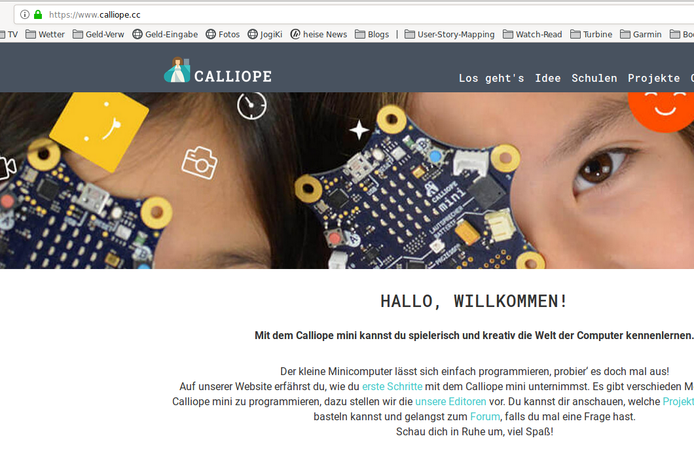
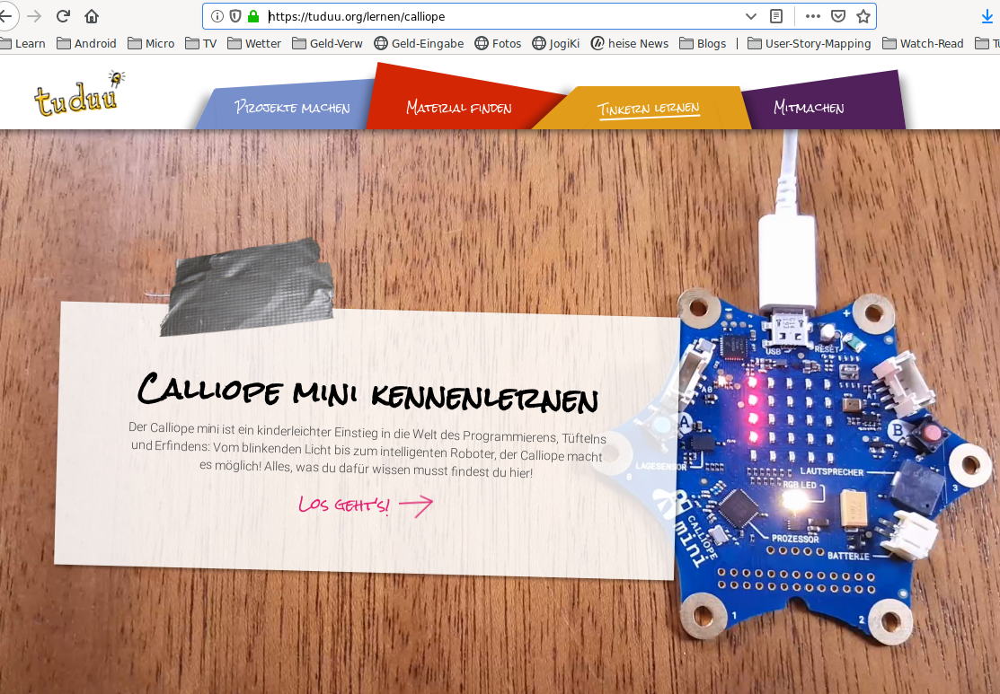
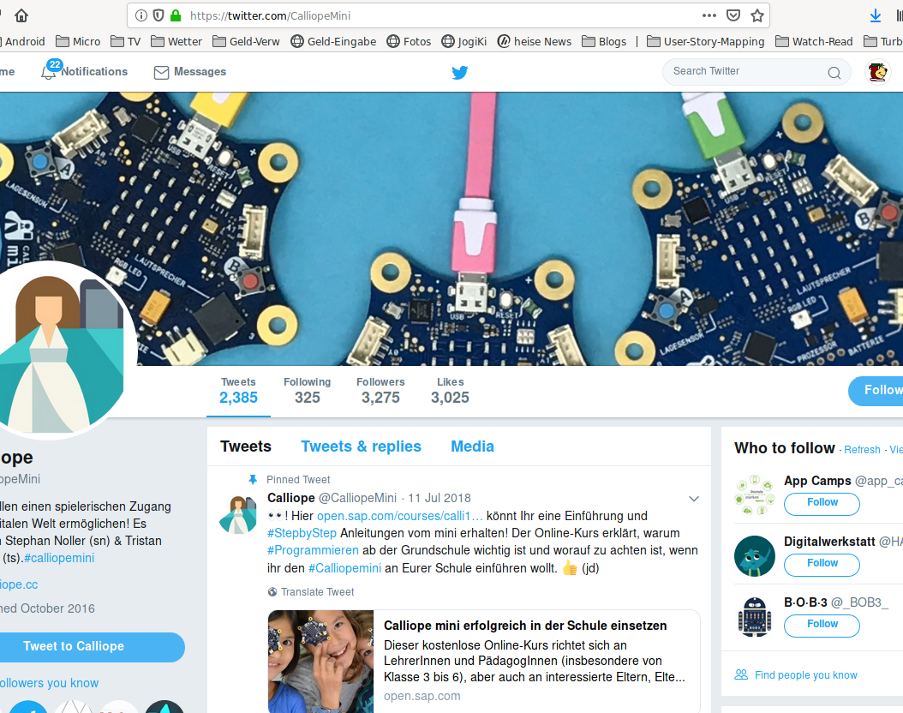
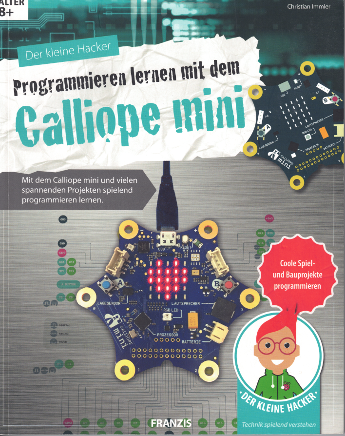
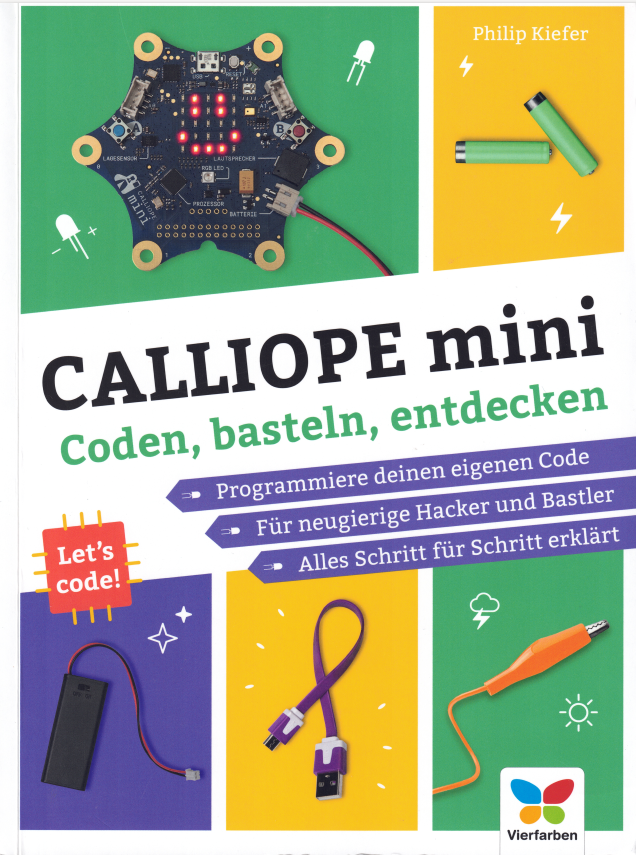
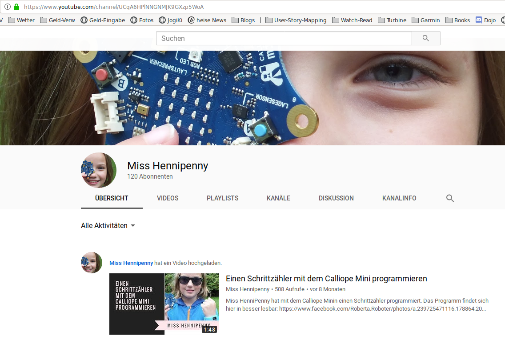

# Weiterführende Infos Calliope

* Websites
* Social Media
* Bücher
* Videos
* Lernmaterial frei/kommerziell
* Organisationen, "Hackatons", Codedojo, etc 

**Speziell für Lehrer**

* MOOC für Lehrer (Massive open online course)
* Lehr-Bücher
* Lehr-Materialen für den Unterricht
* Websites für Lehrer
* Anregungen für Einbindung in Unterricht

# Allgemeine Infos

## Webseiten (1)

{height=80%}

## Webseiten (2)

## Webseiten (3)

## Webseiten (4)

## Webseiten (5)

## Webseiten (6)

## Webseiten (7)

## Webseiten (8)

## Webseiten (9)

* Die Webpage von calliope selbst : <www.calliope.cc>
  * Viele dort verlinkte Seiten
  * Website von Hackster.io , <www.hackster.io/calliope-mini>

* Die Web-Page von Calliope Saarland: <www.calliope-saarland.de>
* Die Calliope-Seite von tuduu: <https://tuduu.org/lernen/calliope>
* Der Calliope Advents-Kalender : <https://www.marcusschütte.com/advent>
* Die Webpage von diesem Kurs : <www.calliope-jogi.org>

## Social Media

- Offizieller Twitter-Kanal von Calliope : <https://twitter.com/CalliopeMini>
- Twitter-Kanal von Calliope Saarland : <https://twitter.com/calliope_saar>
- Offizielle Twitter-Kanal von Hackster.io : <https://twitter.com/Hacksterio>

{height=50%}

## Bücher (1)

\colA{6cm}

{height=80%}

\colB{6cm}

__Für Dummies: Programmieren mit dem Calliope mini __

* Guter Einstieg
* Mittlere Qualität
* Die wichtigsten Themen abgedeckt
* billig

\colEnd

## Bücher (2)

\colA{6cm}

{height=80%}

\colB{6cm}

__Franzis Verlag : Programmieren lernen mit dem Calliope mini __

- Guter Einstieg
- Meines Erachtens besere Qualität als das Dummies-Buch
- Ebenso : Die wichtigsten Themen abgedeckt
- auch billig

\colEnd

## Bücher (3)

\colA{6cm}

\colB{6cm}

__Vierfarben : Calliope mini, Coden, basteln, entdecken__

* Aus meiner Sicht : Das Beste der Bücher
* Einstieg , aber auch sehr umfassend
* Das teurste, aber wie geschrieben, subjektiv das Beste der Bücher

\colEnd

## Bücher (4)

\colA{6cm}

\colB{6cm}

__Burkhard Kainka: Calliope und Micro:Bit in der Praxis__

* Fortgeschrittenen-Buch
* Sehr tiefgehende Themen
* Definitiv nichts für Anfänger
* "echte" Elektronik-Kenntnisse benötigt 

\colEnd

## Bücher (5)

\colA{6cm}

{height=80%}

\colB{6cm}

__DK-Verlag: Programmieren supereasy, Scratch und Python__

* Stellvertretend für andere Konzepte
* Ein SEHR gutes Buch zum Einstieg
* Zuerst Scratch, grafisches Programmieren
* Zweiter Teil, mit einer richtigen Sprache: Python
* 

\colEnd

## Bücher frei/online (1)

\colA{6cm}

\colB{6cm}

__dpunkt-Verlag : Das Calliope-Buch __

* Das erste Calliope Buch überhaupt
* Das offizielle Buch von calliope selbst
* Mehrere Autoren, mehrere Projekte
* Unterschiedlicher Schreibstil
* Frei verfügbar online : <www.dpunkt.de/calliope>
* Als gedrucktes Buch : 22.90 € 

\colEnd

## Bücher frei/online (2)

\colA{6cm}

\colB{6cm}

__Cornelsen-Verlag : Coden mit dem Calliope mini__

* 3 Bücher als PDF online verfügbar

  * 2 * Schülermaterial
  * 1 * Lehrermaterial

* Online hier:  <www.cornelsen.de/calliope>

* Gedruckte Version : je 6.50 € bzw 12.99 € für Lehrer-Material

\colEnd

## Videos (1)

Einführungs-Video von Kindern für Kinder  

Miss Hennipenny : https://www.youtube.com/channel/UCqA6HPlNNGNMJK9GXzp5WoA

{height=60%}

## Videos (2)

{height=70%}

## Videos (3)

Kurzes Einführungs-Video auf dem KIKA-Kanal:

Video auf Kika : <https://www.kika.de/timster/videos/video45586.html>

## Videos (4)

Youtube-Kanal eines "Creative Coders"

Sehr viele meist kurze Videos zum Calliope

{height=70%}

## Videos (5)

{height=70%}

<https://www.youtube.com/channel/UC7voBbTQLtXHYfVneiq36Ig/videos>

## Videos (6) Zusammenfassung

Miss Hennipenny : https://www.youtube.com/channel/UCqA6HPlNNGNMJK9GXzp5WoA

Video auf Kika : <https://www.kika.de/timster/videos/video45586.html>

Youtube: Creative Coder <https://www.youtube.com/channel/UC7voBbTQLtXHYfVneiq36Ig/videos>

## Lernmaterial frei

## Lernmaterial kommerziell

## Organisationen, Hackatons etc

# Infos speziell für Lehrer

## MOOC für Lehrer (Massive open online course)

## Lehr-Bücher

## Lehr-Materialen für den Unterricht

https://www.science-on-stage.de/page/display/de/7/7/1442/coding-im-mint-unterricht

## Websites für Lehrer

## Weiterführend Offline

__Jugend Hackt, speziell in der Schweiz__:  

https://jugendhackt.org/anmeldung-fuer-jugend-hackt-schweiz/

__CoderDojo Luzer : letzter Sonntag im Monat__:  

<https://coderdojoluzern.ch/>

__CoderDojo Zürich (jeden Sonntag) :__ 

<https://www.meetup.com/de-DE/Coder-Dojo-Zurich/>

__Elektronik, Arduino, Calliope-Meetup Turbine, alle 2-3 Wochen:__

<https://www.meetup.com/de-DE/Arduino-Raspberry-Pi-und-mehr-Innerschwyz/>

### 

### Coding im MINT-Unterricht

https://www.heise.de/make/meldung/Werkstattberichte-Neues-aus-den-Fablabs-und-der-Makerszene-4293363.html

und da drin:

https://www.science-on-stage.de/page/display/de/7/7/1442/coding-im-mint-unterricht

### Einige Infos schon im Google-Drive

Nur um sie nicht im git oder unnötigerweise auf der Homepage zu haben.

## ALLES AUS EVERNOTE

Weiterführende Themen :

- Programmierung des Calliope auch mit Python:  [http://www.tigerjython4kids.ch](http://www.tigerjython4kids.ch/) (unterstützt neu auch den Calliope)

- Wichtig: Ab Mitte März  : [https://www.heise.de/amp/meldung/Kostenloser-Onlinekurs-zu-Coding-und-Making-im-Unterricht-4319755.html](https://www.heise.de/amp/meldung/Kostenloser-Onlinekurs-zu-Coding-und-Making-im-Unterricht-4319755.html?__twitter_impression=true)

- 

- 

- 

- [code.org ](http://code.org/)

- GAnz konkret : hour of code : <https://hourofcode.com/de/learn> bzw eine ganz gute Zusammenstellung vom CoderDojo <https://coderdojoluzern.ch/trainingsanleitungen/hour-of-code/hour-of-code.html>

- Speziell auch die Minecraft und anderen Dinge!

- Homepage vom CoderDojo Luzern

- code your life : Wetterstation

- Leitungstester <>

- Studie Uni Bremen : <https://www.uni-bremen.de/tzi/data/nachrichten/news/detail/News/mini-computer-bew%C3%A4hrt-sich-in-der-grundschule-1/>

- <https://media.ccc.de/v/34c3-8865-digitale_bildung_in_der_schule>

- <https://www.digibits.de/materialien/digibits-unterrichtseinheit-digitale-demokratie-der-calliope-mini-als-wahlcomputer/>

- Und Email gesendet die Lehrer am Wochenende nach dem 30. November

- Angebot von AppCamps :(frei, umsonst) [http://www.appcamps.de](http://www.appcamps.de/)

- 

- Angebot von fobizz.com : (kommerziell) <https://fobizz.com/fortbildung-calliope-mini-im-unterricht/>

- [Zusammenstellung Unterichts-Möglichkeiten (NEPO)  ](https://www.roberta-home.de/lehrkraefte/lerneinheitenexperimente/)

  <https://www.roberta-home.de/lehrkraefte/lerneinheitenexperimente/>

- Tüftel-Akademie : (Kurse kosten) <https://tueftelakademie.de/courses/calliope-mini-einfuehrung/>

- ](https://www.xn--marcussch14tte-yhb3469j.com/advent)

- Open Education Ressources OER bei Tüftel-Akademie : <https://tueftelakademie.de/oer-materialien/>

- <https://www.heise.de/newsticker/meldung/Coding-Detectives-Digitale-Kompetenz-fuer-Schueler-4296707.html>

- Informatische Grundbildung : Grund-Schüler sollen Algorithmen programmieren können:

  <https://dl.gi.de/bitstream/handle/20.500.12116/20121/61-GI-Empfehlung_Kompetenzen_informatische_Bildung_Primarbereich.pdf>

- Wie rechnet ein Computer? Mit der Maus und Lampen  <https://www.youtube.com/watch?v=9l-l_dD6qPQ>

- Kids introducing to Computational Thinking with Python : <https://opensource.com/article/19/2/break-down-stereotypes-python>

- https://www.heise.de/make/meldung/Werkstattberichte-Neues-aus-den-Fablabs-und-der-Makerszene-4293363.html

- Zürich

  - Zürich Karten : <https://phzh.ch/globalassets/phzh.ch/medienbildung/dokumente/kurs-highlights_calliope-karten.pdf>
  - Zürich : PHZH : <https://phzh.ch/mia#calliope>
  - Foto auf Deepthought, PDF auch 

​          Mint au Make

​                  Kostenloses Buch zu Coding im MINT-Unterricht

​                   Siehe : <https://www.heise.de/make/meldung/Werkstattberichte-Neues-aus-den-Fablabs-und-der-Makerszene-4293363.html>

​                   Buch liegt auf   DeepThought

- ​       Bremen (Inhalte auf Google-Drive)
  - <http://elib.suub.uni-bremen.de/edocs/00107011-1.pdf>
  - <http://elib.suub.uni-bremen.de/edocs/00107011-1.pdf>
  - <http://elib.suub.uni-bremen.de/edocs/00107010-1.pdf>
  - <http://elib.suub.uni-bremen.de/edocs/00107009-1.pdf>
  - <http://elib.suub.uni-bremen.de/edocs/00107008-1.pdf>
  - <http://elib.suub.uni-bremen.de/edocs/00107006-1.pdf>
  - <http://elib.suub.uni-bremen.de/edocs/00107005-1.pdf>              
- LPM Saarland, auch alles auf Google-Drive
- 

Möglichkeiten für Lehrer/Kinder 

- 
- 

Kunst: 

- Farbmischung, z.B. <https://makecode.com/_WYTL5t3swhFq>
- 

Musik :

- Musik-Möglichkeiten
- Noten
- Metronom
- Klavier : <https://tuduu.org/projekt/calliope-klavier>
- 

Mathematik:

- Mathelerner, 1*1 per Zufall
- Zufall, Wahrscheinlichkeitsverteilung
- Rechner, Zähler
- ...
- 

Sport:

- Schrittzähler
- Stoppuhr
- Fangen-Spiel (Treffer reduziert Leben)