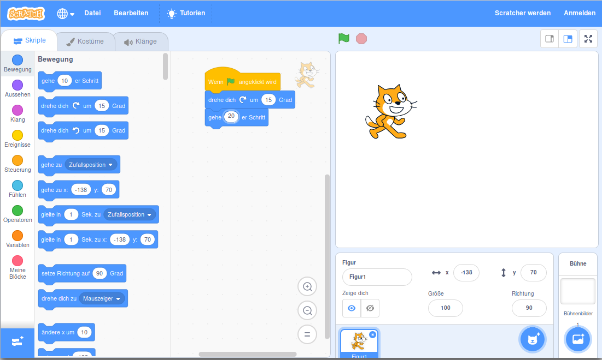
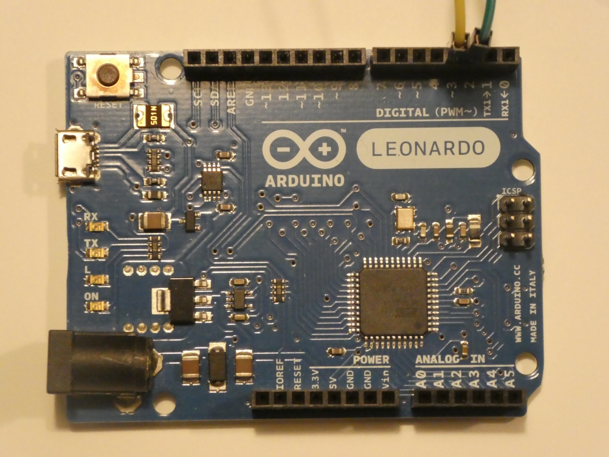
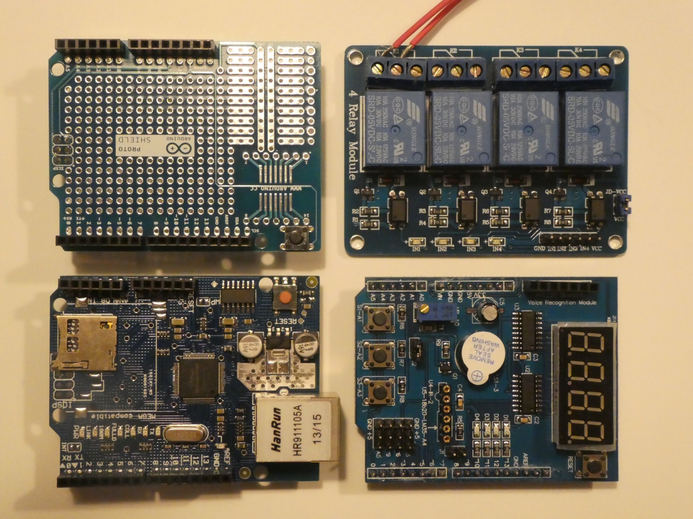
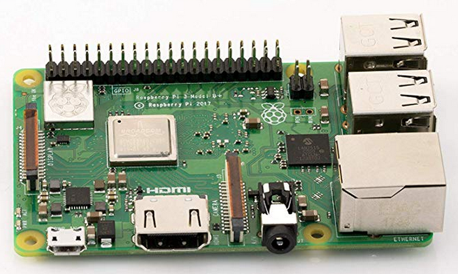
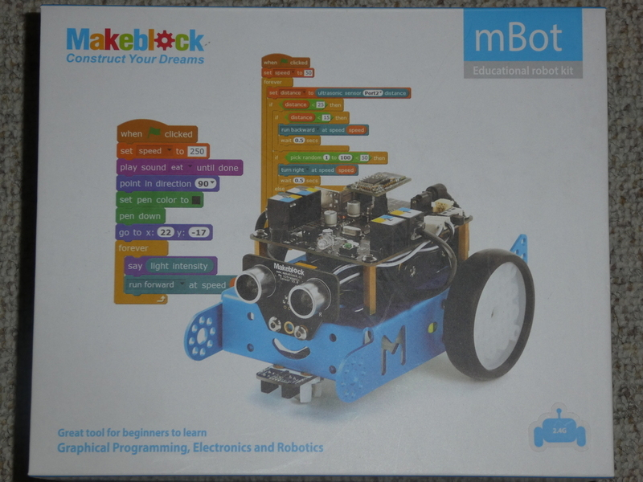

# Warum Calliope

## Zielgruppe

Vor Auswahl eines Konzepts:

* welche Zielgruppe ?
* welche generellen Ziele? 

unter folgenden Gesichtspunkten sind die folgenden Seiten zu sehen:

* Nicht nur am Handy / Computer konsumieren sondern auch 

* Selbst gestalten
* "Computer"-Sprache kennenleren
* Interesse für Computer und Basteln wecken
* Interesse für Programmieren wecken
* Ab ca 9 Jahre
* Wenn möglich in der Schule nutzbar, in den Unterricht intergrierbar 

## Grundüberlegungen

* Umsetzung rein in __Software__
* Möglichst ohne Installation 
* Auf verschiedenen Betriebsystemen nutzbar
* vermutlich Browser-Basiert

oder

* Umsetzung mit Software __und Hardware__
* Zusätzlicher Hardware-Bedarf
* Noch höhere Anforderungen an Material und Budget
* Dafür mehr Integration in die reale Welt möglich 
* Kinder/Schüler können das evt mit nach Hause nehmen
* Je nach Konzept : Einstieg in Robotik 

## Software-Konzepte

* Scratch

* Hour of Code

* uvm, siehe z.B.:
  <https://www.codingkids.de/machen/programmieren-fuer-kinder-11-tolle-ideen>

   

## Scratch

\colA{6cm}

{height=80%}

\colB{6cm}

<https://scratch.mit.edu/>

* Block-Basiert
* Sehr einfach zu lernen
* Doch sehr mächtig
* Browser-Basiert, seit Version 3 auch auf iPad nutzbar
* viele Anleitungen und Hilfen
* meines Erachtens __DIE__ bekannteste Block-Programmiersprache

\colEnd

## Hour of Code/code.org

\colA{6cm}

{height=80%}

\colB{6cm}

<https://hourofcode.com/de/learn>

* Verschiedene "Missionen"
* Fast komplett selbständig durchführbar
* Unterschiedliche Interessengebiete
  * Minecraft !
  * Star-Wars !
  * Flappy - Birds -Spiele  
* komplett browser-basiert
* Sehr toller Startpunkt für "Nur-SW"

\colEnd

## Konzepte mit Hardware

* Arduino
* Raspberry Pi
* BBC Micro:Bit
* Calliope
* Sino:Bit
* Kniwwelino
* Oxo-Card
* EduArdu
* mBot (und andere Robotik-Plattformen)

## Arduino

\colA{6cm}

{height=40%}

{height=40%}

\colB{6cm}

* Der __Urvater__ von __massentauglichen__ Microcontroller-Platinen
* Extrem viel zusätzliche Hardware
* Sehr billig (Clone ab ca 8 CHF)
* Super Einstieg in die Welt der Elektronik und des Programmierens
* Programmierung mit textueller Programmiersprache
* Einfaches Entwicklungs-Umgebung, braucht Installation 
* ab ca 12 Jahren
* ohne Zusatz-Hardware "nutzlos"

\colEnd

## Raspberry Pi

\colA{6cm}

{height=80%}

\colB{6cm}

- Ein kompletter __Linux__-Rechner
- __massentauglicher__ Einplatinen-Rechner
- Extrem viel zusätzliche Hardware, Software verfügbar
- Sehr billig ( Zero ab 8 CHf , Raspi 3 B+ ca 40 CHf)
- Viele verschiedene Programmiersprachen
- braucht Installation 
- ab ca 13 Jahren
- ohne Zusatz-Hardware und Monitor/Tastatur "nutzlos"

\colEnd

## BBC Micro:Bit

\colA{6cm}

\colB{6cm}

\colEnd

## Calliope

\colA{6cm}

{height=80%}

\colB{6cm}

\colEnd

## Sino:Bit

\colA{6cm}

{height=80%}

\colB{6cm}

\colEnd

## Kniwwelino

\colA{6cm}

{height=60%}

\colB{6cm}

\colEnd

## OxoCard

\colA{6cm}

{height=40%}

{height=40%}

\colB{6cm}

\colEnd

## EduArdu

\colA{6cm}

{height=70%}

\colB{6cm}

\colEnd

## mBot

\colA{6cm}

\colB{6cm}

\colEnd

## Fazit

